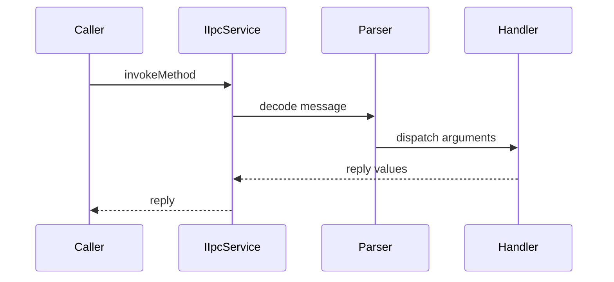
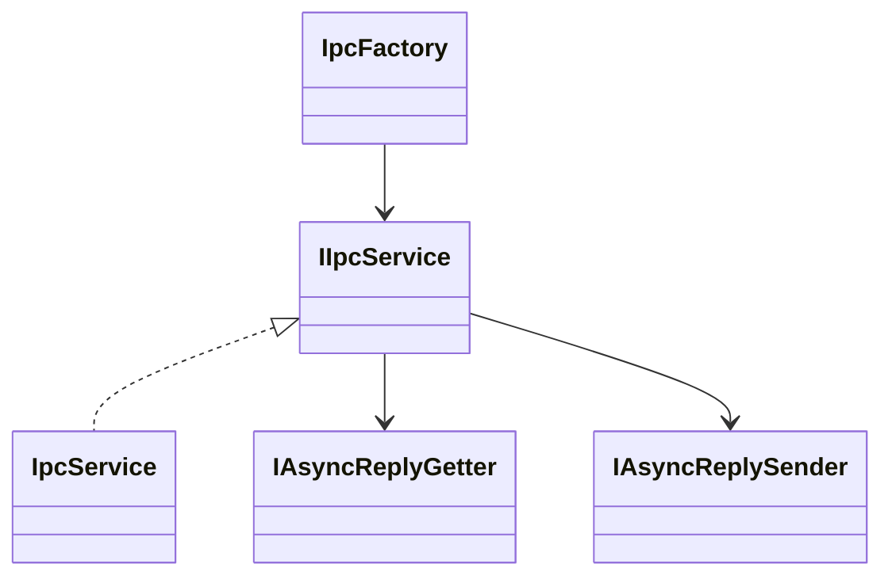
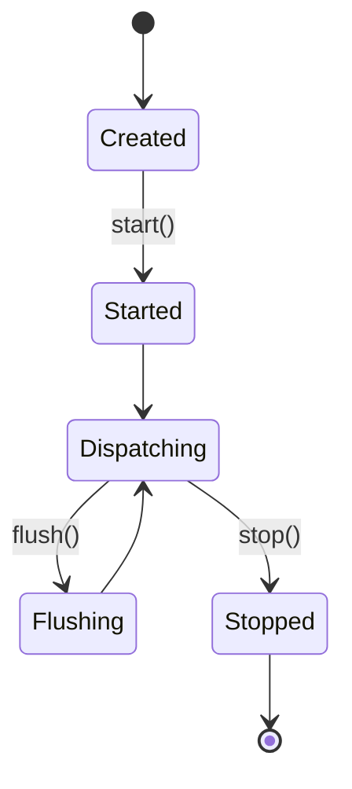
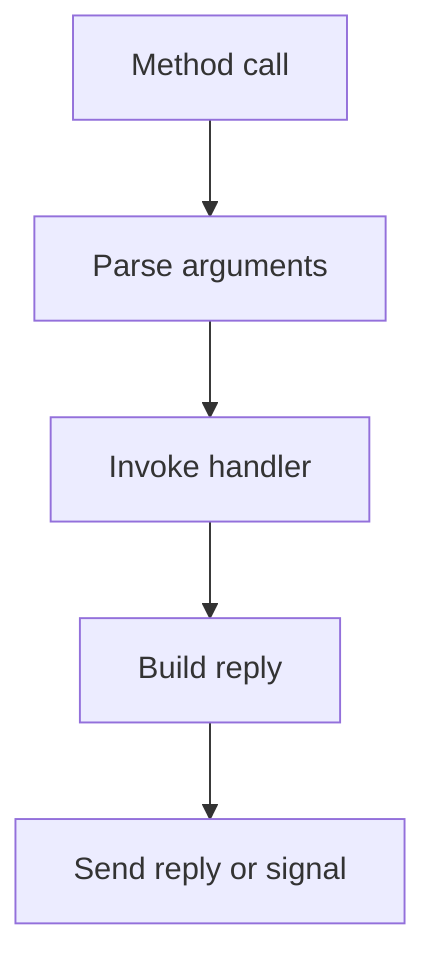

# IPC and D-Bus Subsystem

## 1. High-Level Purpose & Architecture

The IPC subsystem provides the transport-neutral interface used by Dobby clients and the daemon to invoke methods, emit signals, register handlers, and run an event dispatcher. On supported builds it has libdbus and sd-bus implementations.

It does not define container semantics; those are in `protocol/` and daemon/client contracts.

## 2. Architectural Overview

```text
DobbyProxy / Dobby
        |
        v
     IIpcService
       /     \
  libdbus   sd-bus
       \     /
        D-Bus bus
```

## 3. Code Organization (Folder & File-Level)

- `AppInfrastructure/IpcService/include/IIpcService.h`: common service contract.
- `AppInfrastructure/IpcService/include/IpcFactory.h`: implementation selection.
- `AppInfrastructure/IpcService/include/IpcVariantList.h`: typed argument list.
- `AppInfrastructure/IpcService/include/IpcFileDescriptor.h`: descriptor transport.
- `AppInfrastructure/IpcService/source/libdbus/`: libdbus connection, parsing, watches, timeouts, dispatch, and async replies.
- `AppInfrastructure/IpcService/source/sdbus/`: sd-bus service, arguments, and async reply helpers.
- `ipcUtils/include/DobbyIpcBus.h` and `source/DobbyIpcBus.cpp`: Dobby-specific bus setup.
- `ipcUtils/include/DobbyIPCUtils.h` and `source/DobbyIPCUtils.cpp`: Dobby IPC utilities.

The two backend directories contain the implementation files corresponding to connection, message parsing, event dispatch, watches/timeouts, and reply handling. Backend-specific wire details were not fully inspected.

## 4. Class & Interface Documentation

### `AI_IPC::IIpcService`

`IIpcService` exposes validity, synchronous/asynchronous method invocation, signals, handler registration, monitor mode, availability checks, flush, start, stop, and bus address access.

Actual excerpt from [AppInfrastructure/IpcService/include/IIpcService.h](include/IIpcService.h):

```cpp
virtual bool start() = 0;
virtual bool stop() = 0;
virtual void flush() = 0;
```

`start()` begins the dispatcher; `stop()` terminates it. For the libdbus backend, `flush()` drains queued messages/handlers, while the sd-bus implementation treats it as a no-op, so callers must not rely on it for synchronization there.

### Backend classes

`IpcService`/`BaseService` and their sd-bus equivalents implement transport details. `AsyncReplyGetter` and `AsyncReplySender` bridge asynchronous calls. `DbusConnection`, `DbusMessageParser`, `DbusEventDispatcher`, `DbusWatches`, and `DbusTimeouts` divide libdbus responsibilities.

## 5. Configuration & Build Integration

Top-level CMake requires `dbus`; `USE_SYSTEMD` selects systemd/sd-bus integration, while disabled builds use libdbus APIs. Dobby service/object defaults are set in `protocol/include/DobbyProtocol.h` and can be overridden by `DOBBY_SERVICE` and `DOBBY_OBJECT` CMake settings.

## 6. Internal Workflows & Execution Flow

Initialization constructs a backend through the factory, registers methods/signals, and calls `start()`. A request is parsed into a `VariantList`, dispatched to a handler, and answered synchronously or through an async reply sender. Signals are emitted to subscribers. `flush()` is used to drain queued work before coordinated shutdown; `stop()` ends the dispatcher.

Error handling is represented by boolean/empty-pointer returns in the interface. Detailed backend error mapping is not documented here because it is implementation-specific.

## 7. Diagrams & Visual Aids









## 8. Testing & Quality Analysis

Existing tests include `AppInfrastructure/IpcService/test/source/IIpcServiceTests.cpp`, `DbusEntitlementsTest.cpp`, and common IPC utility tests. Add backend parity tests, timeout and disconnect tests, FD ownership tests, flush ordering tests, malformed signature tests, and start/stop idempotence tests. The repository does not prove identical behavior for every backend from the inspected headers.

## 9. Beginner-to-Expert Teaching Mode

**Must know first:** IPC is the message boundary; `IIpcService` hides whether the backend is libdbus or sd-bus.

**Advanced path:** study `VariantList` encoding, asynchronous reply ownership, event-dispatch threading, match rules, and the precise differences introduced by `USE_SYSTEMD`.
