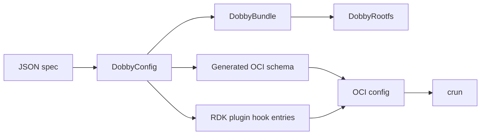
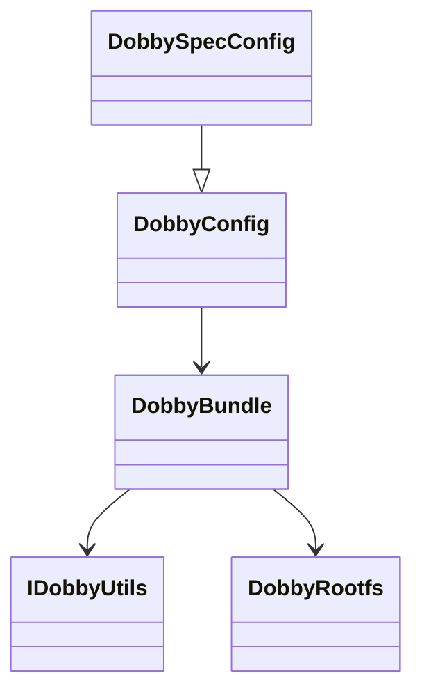
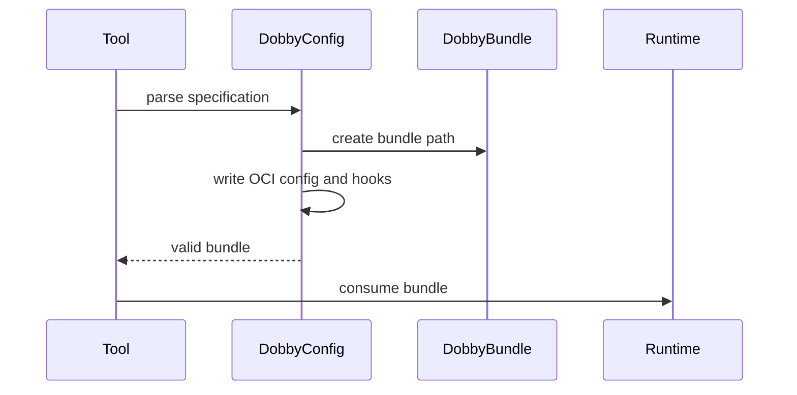
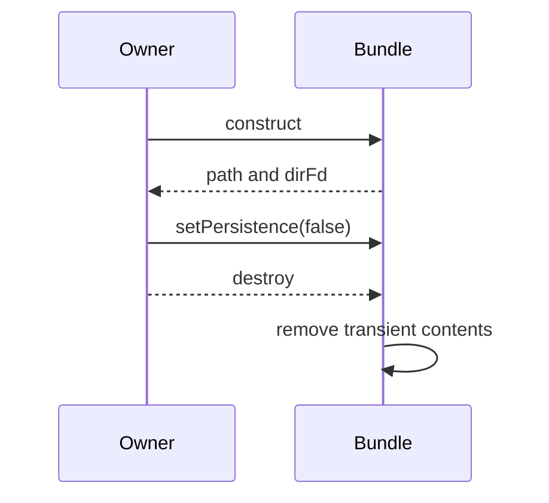

# Bundle and OCI Configuration Subsystem

## 1. High-Level Purpose & Architecture

The bundle subsystem converts Dobby specifications into OCI-compatible bundle state and manages bundle directories used by the daemon. In RDK infrastructure it is the boundary between user/container configuration and runtime-consumable OCI data.

It owns configuration parsing, rootfs and bundle helpers, plugin hook insertion, and schema-backed data. It does not launch containers or provide D-Bus transport.

## 2. Architectural Overview

```text
Dobby spec / JSON
       |
       v
 DobbySpecConfig / DobbyConfig
       |
       +--> rt_dobby_schema
       +--> bundle directory + rootfs
       +--> RDK/legacy hook entries
       v
     crun OCI bundle
```

## 3. Code Organization (Folder & File-Level)

- `bundle/lib/include/DobbyConfig.h`: abstract configuration contract and common mutation helpers.
- `bundle/lib/source/DobbyConfig.cpp`: configuration operations.
- `bundle/lib/include/DobbySpecConfig.h` and `source/DobbySpecConfig.cpp`: spec-backed configuration.
- `bundle/lib/include/DobbyBundle.h` and `source/DobbyBundle.cpp`: bundle directory lifetime and persistence.
- `bundle/lib/include/DobbyRootfs.h` and `source/DobbyRootfs.cpp`: rootfs handling.
- `bundle/lib/include/DobbyTemplate.h` and `source/DobbyTemplate.cpp`: legacy template support.
- `bundle/tool/source/Main.cpp`: bundle generator command line entry point.
- `bundle/CMakeLists.txt` and `bundle/lib/CMakeLists.txt`: target definitions; exact install targets should be checked when packaging changes.

## 4. Class & Interface Documentation

### `DobbyConfig`

`DobbyConfig` exposes validity, identity, bus choices, console policy, restart policy, rootfs, generated schema, and plugin maps. It also provides helpers such as `addMount`, `addEnvironmentVar`, `changeProcessArgs`, `writeConfigJson`, and `setPidsLimit`.

Actual declaration from [bundle/lib/include/DobbyConfig.h](lib/include/DobbyConfig.h):

```cpp
virtual bool isValid() const = 0;
virtual std::shared_ptr<rt_dobby_schema> config() const = 0;
virtual const std::map<std::string, Json::Value>& rdkPlugins() const = 0;
```

### `DobbyBundle`

`DobbyBundle` creates or adopts a directory, exposes its path and directory file descriptor, and deletes its contents on destruction unless persistence is enabled. It depends on `IDobbyUtils` and environment information.

### `DobbyRootfs`, `DobbySpecConfig`, and `DobbyTemplate`

These classes specialize rootfs lifetime, JSON/spec interpretation, and legacy templating respectively. Their complete method contracts are not reproduced here because only the central configuration and bundle headers were inspected.

## 5. Configuration & Build Integration

`DobbyConfig.h` defines plugin names including `networking`, `logging`, `ipc`, `storage`, `gpu`, and `rtscheduling`. Generated `rt_dobby_schema.h` comes from `libocispec`; top-level CMake calls `GenerateLibocispec(EXTRA_SCHEMA_PATH "${EXTERNAL_PLUGIN_SCHEMA}")`. `LEGACY_COMPONENTS` enables legacy configuration/template paths and the bundle generator in debug builds.

## 6. Internal Workflows & Execution Flow

1. JSON is parsed into a schema-backed configuration.
2. The configuration validates identity, user, runtime, mounts, environment, and plugin data.
3. Bundle helpers create or adopt the bundle directory and rootfs.
4. `DobbyConfig` writes OCI JSON and adds plugin launcher hook entries.
5. The daemon or bundle tool consumes the resulting bundle.
6. Destruction removes transient bundle data unless persistence was requested.

The exact validation rules are distributed across `DobbySpecConfig.cpp` and generated schema code; missing or platform-specific rules should be verified there.

## 7. Diagrams & Visual Aids









## 8. Testing & Quality Analysis

`tests/L1_testing/tests/DobbySpecConfigTest/DobbySpecConfigTest.cpp` and link stubs cover spec configuration. Existing tests should be extended for malformed JSON, schema/version mismatches, unsafe paths, plugin hook generation, persistence semantics, and cleanup after partial construction. Generated schema behavior is a dependency and should be tested after CMake regeneration.

## 9. Beginner-to-Expert Teaching Mode

**Must know first:** a Dobby spec describes a container, while an OCI bundle is the runtime directory plus OCI config derived from that spec.

**Advanced path:** follow `DobbySpecConfig` into schema validation, then inspect how `DobbyConfig` mutates mounts, environment, hooks, and runtime limits before `crun` receives the bundle.
