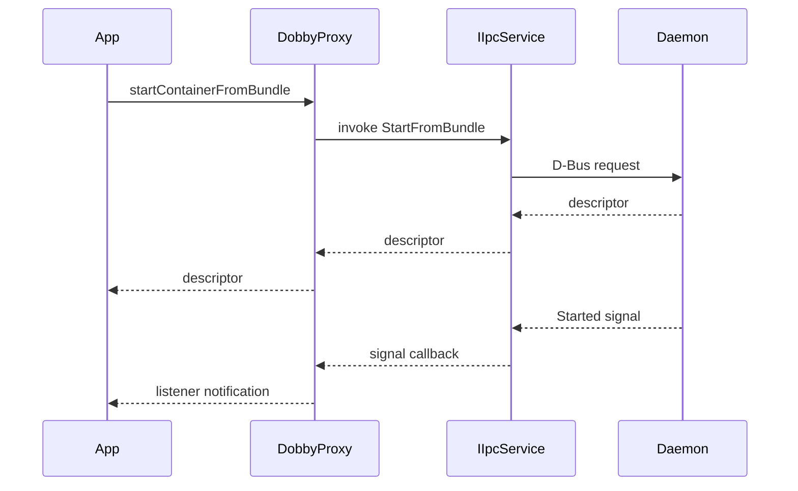
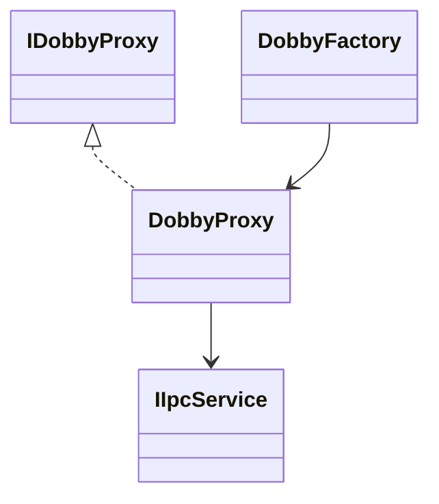
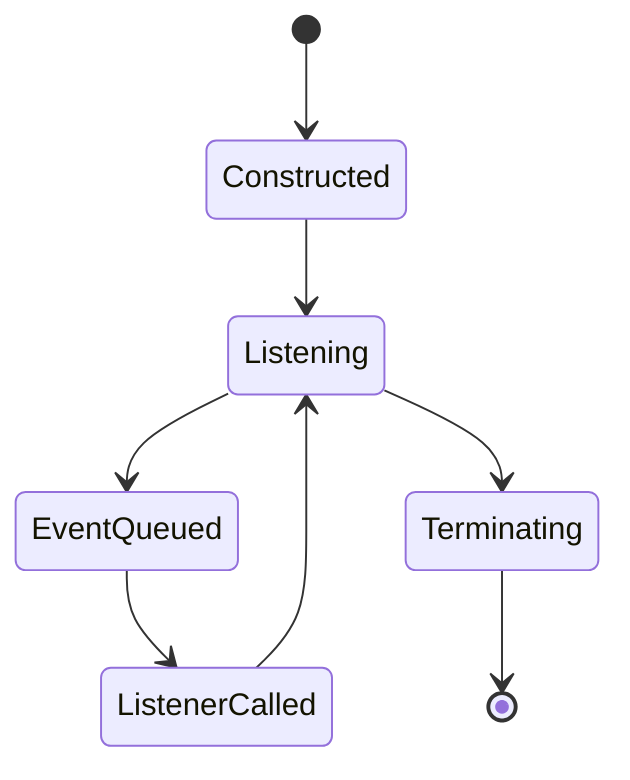
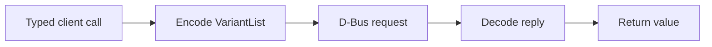

# Client Subsystem

## 1. High-Level Purpose & Architecture

The client library gives applications a typed C++ API for controlling Dobby containers without constructing D-Bus messages directly. It belongs on the caller side of the ENT/RDK container service boundary.

It does not create OCI bundles, manage Linux namespaces, or own the daemon lifecycle.

## 2. Architectural Overview

```text
Application
    |
IDobbyProxy / DobbyProxy
    |
IIpcService
    |
Dobby daemon D-Bus interfaces
```

## 3. Code Organization (Folder & File-Level)

- `client/lib/include/DobbyProxy.h`: typed proxy API and listener state.
- `client/lib/include/DobbyFactory.h`: proxy construction.
- `client/lib/source/DobbyProxy.cpp`: D-Bus calls and event translation.
- `client/lib/source/DobbyFactory.cpp`: factory implementation.
- `client/lib/source/Upstart.h` and `Upstart.cpp`: legacy service integration.
- `client/tool/source/Main.cpp`: command-line client/tool entry.
- `AppInfrastructure/Public/Dobby/IDobbyProxy.h`: public API contract.
- `client/CMakeLists.txt`: client library/tool targets.

## 4. Class & Interface Documentation

### `DobbyProxy`

`DobbyProxy` implements administrative and control operations, including start from spec/bundle, stop, pause, resume, hibernate, wakeup, mount, annotations, exec, state, info, listing, and listener registration. It maintains a state-change thread and event queue.

Excerpt from [client/lib/include/DobbyProxy.h](lib/include/DobbyProxy.h):

```cpp
bool stopContainer(int32_t cd, bool withPrejudice) const override;
int registerListener(const StateChangeListener &listener, const void* cbParams) override;
void unregisterListener(int id) override;
```

The proxy translates D-Bus signals into listener callbacks. Destruction must stop the state-change processing thread; exact ordering is implemented in `DobbyProxy.cpp`.

### `DobbyFactory`

The factory hides construction details and supplies the IPC service, service name, and object path. The exact overload set should be read from `DobbyFactory.h` when integrating a new caller.

## 5. Configuration & Build Integration

The library uses `DOBBY_BUILD` include paths internally and public installed include paths externally. Service/object defaults come from `DobbyProtocol.h`; callers can use the configured D-Bus address through the factory/API. The tool is built under `client/tool`.

## 6. Internal Workflows & Execution Flow

1. A caller obtains a proxy from the factory.
2. A typed method builds an IPC method and arguments.
3. `invokeMethod` performs the request and decodes the result.
4. Dobby emits lifecycle signals.
5. The proxy queues signal events and invokes registered listeners on its state-change thread.
6. Proxy destruction unregisters/terminates event processing.

The exact failure values for each public operation are defined in the public interface and implementation; callers should treat `false`, invalid descriptors, and empty info as failures.

## 7. Diagrams & Visual Aids









## 8. Testing & Quality Analysis

`tests/L1_testing/tests/DobbyProxyTest/DobbyProxyTests.cpp` covers proxy behavior. Suggested additions include listener ordering, unregister races, daemon disconnects, timeout propagation, FD passing, and destruction while events are queued. The inspected source does not establish thread-safety guarantees for user callbacks, so this should be tested and documented.

## 9. Beginner-to-Expert Teaching Mode

**Must know first:** `DobbyProxy` is a typed remote-control object, not the container itself.

**Advanced path:** trace a method through `invokeMethod`, then inspect how signal subscriptions, queue synchronization, callback lifetime, and public ABI compatibility are maintained.
