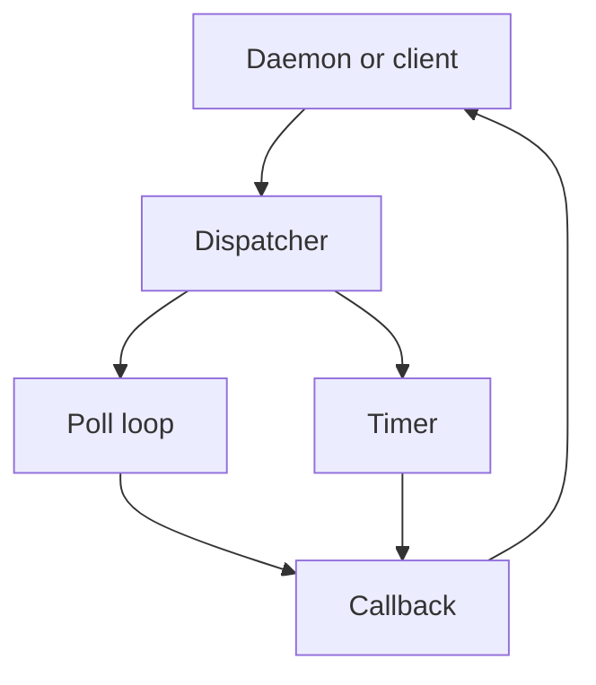
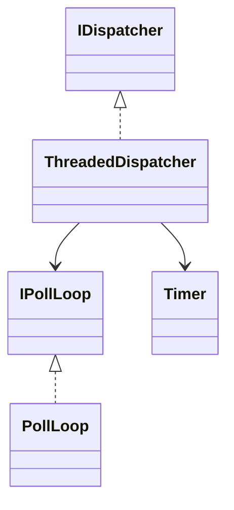
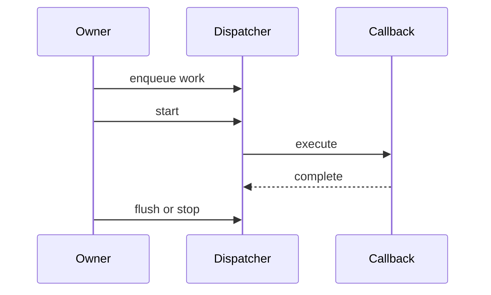
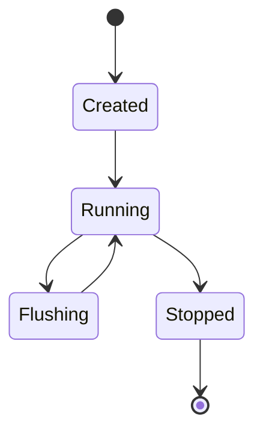

# AppInfrastructure Subsystem

## 1. High-Level Purpose & Architecture

AppInfrastructure contains reusable transport, concurrency, logging, readline, and common utility primitives used by the daemon, client, and plugins. It is the shared foundation rather than an application-facing container manager.

It does not decide Dobby container policy or define plugin-specific hardware operations.

## 2. Architectural Overview

```text
Daemon / client / plugins
          |
+---------+----------+
| Common | IPC | Log |
| ReadLine | Tracing |
+---------+----------+
```

## 3. Code Organization (Folder & File-Level)

- `AppInfrastructure/Common/include`: `Timer`, `PollLoop`, `ThreadedDispatcher`, `ConditionVariable`, `Mutex`, `SpinLock`, `Notifier`, `FileUtilities`, `IDGenerator`, and related interfaces.
- `AppInfrastructure/Common/source`: implementations including `PollLoop.cpp`, `ThreadedDispatcher.cpp`, `Timer.cpp`, and filesystem/hash helpers.
- `AppInfrastructure/Common/test/source`: focused unit tests for timers, dispatchers, file utilities, watchers, IDs, and synchronization.
- `AppInfrastructure/IpcService`: D-Bus abstraction and backends; documented separately in [ipc.md](ipc.md).
- `AppInfrastructure/Logging`: logging implementation and public macros.
- `AppInfrastructure/ReadLine`: terminal line-reading abstraction.
- `AppInfrastructure/Tracing`: tracing support used when enabled.
- `AppInfrastructure/Public/Common`: common public interfaces such as `Interface`, `Notifier`, `IDispatcher`, and `Polymorphic`.

## 4. Class & Interface Documentation

The common library is interface-oriented. `IPollLoop` abstracts polling; `ThreadedDispatcher` and `CallerThreadDispatcher` provide task execution; `Timer` schedules time-based work; `Notifier` supports notifications; `IDGenerator` creates identifiers.

Representative tests include `TimerTest.cpp`, `ThreadedDispatcherTest.cpp`, `NotifierTest.cpp`, and `FileWatcherTest.cpp`. The exact public members should be taken from each header when extending a primitive; this document avoids inventing contracts for every helper.

## 5. Configuration & Build Integration

Top-level CMake always adds Common, Logging, IpcService, ReadLine, and AppInfrastructure Tracing. Tracing is additionally controlled by `ENABLE_PERFETTO_TRACING`. The common code is built as part of the main CMake graph and consumed through include directories and targets declared in component CMake files.

## 6. Internal Workflows & Execution Flow

A typical dispatcher workflow is: construct primitive, register work/callback, start a loop or worker, execute callbacks, flush or stop, then destroy. File watchers and timers feed dispatchers; IPC and daemon code build higher-level flows on top.

Error and shutdown behavior are primitive-specific. Lock ownership and callback reentrancy must be checked in the relevant class implementation before use.

## 7. Diagrams & Visual Aids









## 8. Testing & Quality Analysis

The Common test directory is substantial and covers many primitives. Missing high-value cases are callback exceptions, shutdown with queued work, timer cancellation races, watcher disappearance, poll descriptor errors, and deterministic stress tests under sanitizers. The test inventory does not prove coverage of all public edge cases.

## 9. Beginner-to-Expert Teaching Mode

**Must know first:** these are reusable building blocks for time, files, polling, and dispatch, not Dobby-specific policy.

**Advanced path:** study happens-before relationships, callback ownership, dispatcher shutdown, FD lifecycle, and how IPC builds on the primitives.
