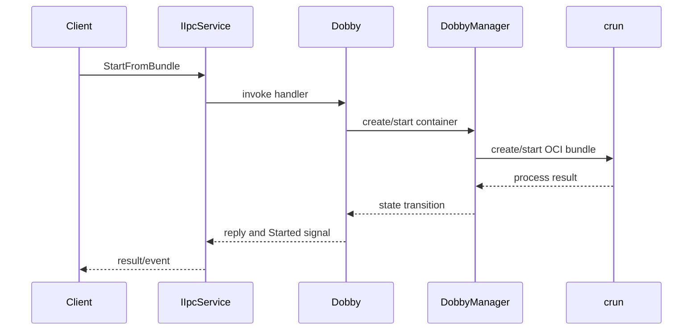
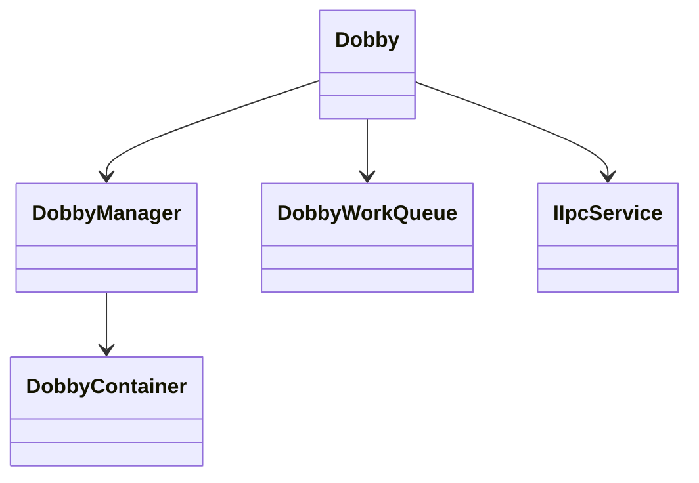
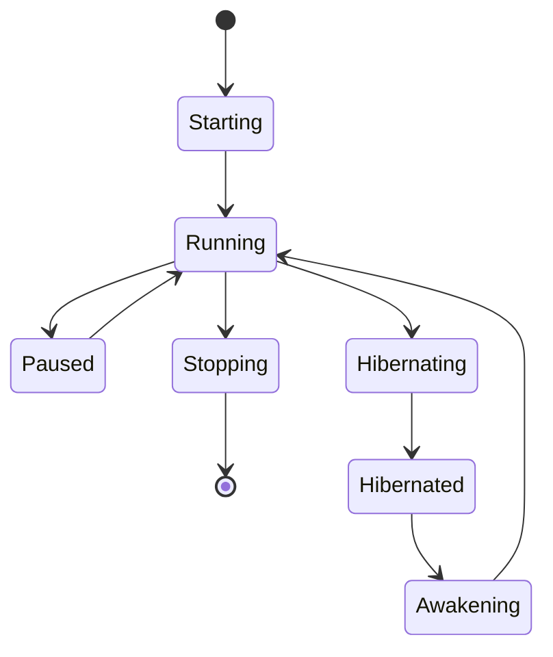

# Daemon Subsystem

## 1. High-Level Purpose & Architecture

Dobby is the resident RDK/ENT container-management daemon. It exposes administrative and container-control operations over D-Bus and coordinates OCI bundle execution, container state, logging, and lifecycle hooks.

Responsibilities include registering D-Bus methods, translating requests into manager operations, tracking descriptors and state, and publishing lifecycle events. It does not implement the D-Bus transport itself, parse every configuration detail itself, or provide plugin business logic.

## 2. Architectural Overview

```text
DobbyTool / DobbyProxy
          |
          v
     IIpcService / D-Bus
          |
          v
       Dobby
          |
   DobbyManager + WorkQueue
          |
 Bundle + Config + Rootfs + RDK plugins
          |
        crun / Linux
```

## 3. Code Organization (Folder & File-Level)

- `daemon/init/source/InitMain.cpp`: process entry used to initialize the daemon.
- `daemon/process/source/Main.cpp`: daemon process entry and command-line/service integration; exact option handling should be verified in the source.
- `daemon/process/dobby.service`: systemd unit.
- `daemon/lib/include/Dobby.h`: daemon facade and D-Bus method surface.
- `daemon/lib/source/Dobby.cpp`: facade implementation.
- `daemon/lib/source/include/DobbyContainer.h`: per-container resource and state record.
- `daemon/lib/source/DobbyContainer.cpp`: descriptor allocation and restart bookkeeping.
- `daemon/lib/source/DobbyManager.cpp`: container orchestration.
- `daemon/lib/source/DobbyWorkQueue.cpp`: asynchronous work dispatch.
- `daemon/lib/source/DobbyRunC.cpp`: runtime command integration.
- `daemon/lib/source/DobbyRootfs.cpp`: root filesystem handling.
- `daemon/lib/source/DobbyHibernate.cpp`: hibernation support.
- `daemon/lib/source/DobbyLogger.cpp` and `DobbyLogRelay.cpp`: daemon logging paths.

The exact sequencing between `DobbyManager`, `DobbyRunC`, and plugin hooks is distributed across their `.cpp` files; this document does not infer details not visible in the public headers.

## 4. Class & Interface Documentation

### `Dobby`

`Dobby` owns the daemon-level collaborators and exposes methods such as `startFromSpec`, `startFromBundle`, `stop`, `pause`, `resume`, `hibernate`, `wakeup`, `exec`, `list`, `getState`, and `getInfo`. It stores `mManager`, `mWorkQueue`, `mIpcService`, service/object names, and shutdown state.

Representative declaration from [daemon/lib/include/Dobby.h](../daemon/lib/include/Dobby.h):

```cpp
void run() const;
void setDefaultAIDbusAddresses(const std::string& aiPrivateBusAddress,
                               const std::string& aiPublicBusAddress);
```

Construction receives an IPC service and settings. `run()` owns the main loop; shutdown and signal handlers drive teardown. The exact registration names are implemented by `initIpcMethods()`.

### `DobbyContainer`

`DobbyContainer` is a manager-owned record containing bundle, config, rootfs, optional plugin manager, controller PID, state, restart policy, and a unique descriptor. The lifecycle states are `Starting`, `Running`, `Stopping`, `Paused`, `Hibernating`, `Hibernated`, and `Awakening`.

## 5. Configuration & Build Integration

Top-level `CMakeLists.txt` uses C++14, `-Wall`, `RDK`, `DOBBY_BUILD`, and a selected `RDK_PLATFORM`. `USE_SYSTEMD`, `LEGACY_COMPONENTS`, `ENABLE_PERFETTO_TRACING`, `USE_STARTCONTAINER_HOOK`, and `ENABLE_OPT_SETTINGS` alter daemon capabilities. The D-Bus service and object defaults are `org.rdk.dobby` and `/org/rdk/dobby`.

## 6. Internal Workflows & Execution Flow

1. Process entry loads settings and constructs the IPC service.
2. `Dobby` registers admin/control/debug handlers.
3. `run()` starts the IPC/event path and work queue.
4. A control request is decoded, queued, and delegated to the manager.
5. The manager creates or finds a `DobbyContainer`, prepares bundle/config/rootfs, invokes the runtime, and reports state changes.
6. Events are emitted through IPC; shutdown stops work, runtime resources, and IPC.

Failure behavior, restart backoff, and hibernation abort details require reading the corresponding implementation files and are intentionally not guessed here.

## 7. Diagrams & Visual Aids







## 8. Testing & Quality Analysis

Existing focused tests include `tests/L1_testing/tests/DobbyTest/DaemonDobbyTests.cpp` and `DobbyManagerTest/DaemonDobbyManagerTest.cpp`. Tests also use mocks for manager collaborators. Suggested additions are failure-path tests for IPC registration, runtime-start failure cleanup, concurrent stop/start requests, restart policy limits, and hibernation interruption. The inspected headers do not establish full integration coverage.

## 9. Beginner-to-Expert Teaching Mode

**Must know first:** Dobby is a daemon, D-Bus is its request boundary, a descriptor identifies a managed container, and `DobbyManager` owns lifecycle work.

**Advanced path:** trace one `StartFromBundle` request through `Dobby`, the work queue, `DobbyManager`, `DobbyContainer`, `DobbyRunC`, and RDK hook execution. Then study signal delivery, restart policy, and hibernation concurrency in the implementations.
