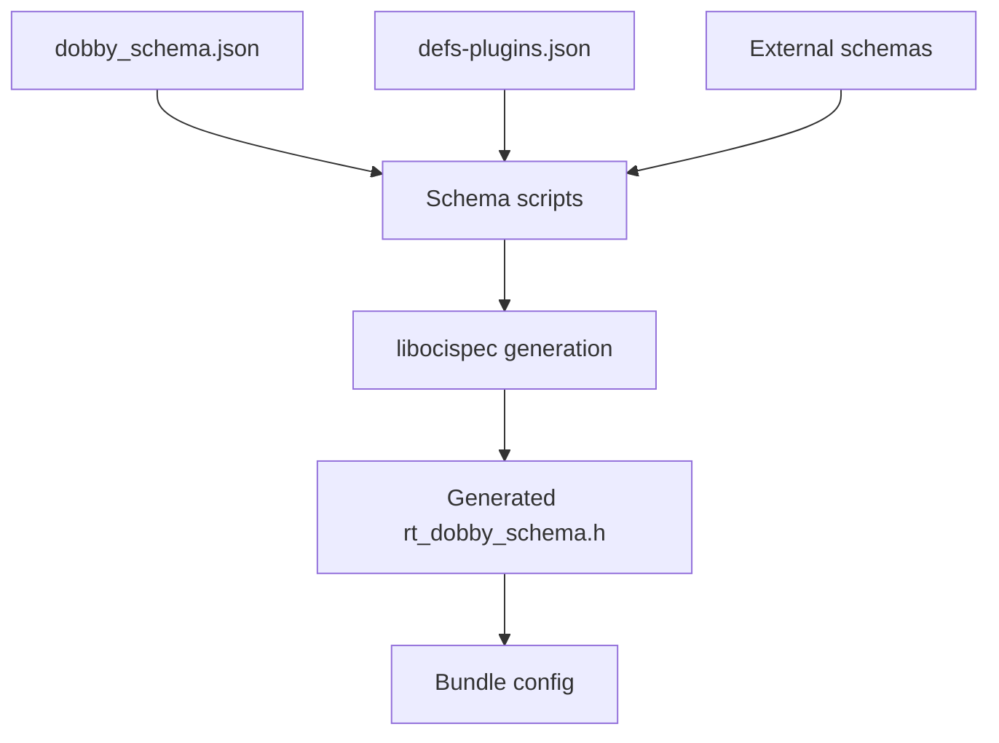
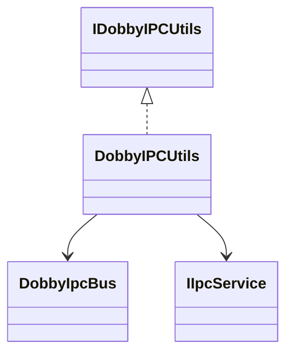
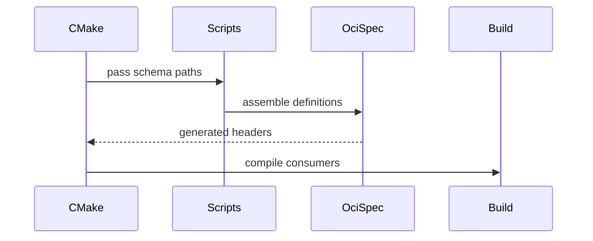
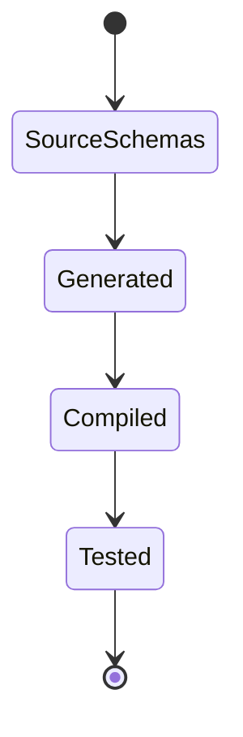

# IPC Utilities, Runtime Schema, and Test Infrastructure

## 1. High-Level Purpose & Architecture

This component groups Dobby-specific IPC helpers, generated runtime schema inputs, and test doubles. It supports the contracts described by the daemon, client, bundle, and plugin documents.

It does not itself provide the complete IPC backend, daemon lifecycle, or schema generation toolchain.

## 2. Architectural Overview

```text
DobbyProtocol + IPC service
          |
     ipcUtils helpers
          |
    daemon and client

runtime-schemas -> libocispec generation -> rt_dobby_schema.h
```

## 3. Code Organization (Folder & File-Level)

- `ipcUtils/include/DobbyIpcBus.h`: bus address/setup contract.
- `ipcUtils/include/DobbyIPCUtils.h`, `IDobbyIPCUtils.h`: Dobby-specific IPC operations.
- `ipcUtils/source/DobbyIpcBus.cpp`, `DobbyIPCUtils.cpp`: implementations.
- `runtime-schemas/dobby_schema.json`: base runtime schema.
- `runtime-schemas/defs-plugins.json`: plugin definitions.
- `runtime-schemas/add_external_plugin_schema.py`, `add_plugin_tables.py`: schema assembly scripts.
- `tests/L1_testing/mocks/`: mock implementations for daemon, IPC, bundle, utility, plugin, and runtime collaborators.
- `tests/L1_testing/tests/`: unit tests for daemon, manager, proxy, configuration, and utilities.

The generated libocispec outputs are build artifacts and may not exist in a source checkout until CMake configuration runs.

## 4. Class & Interface Documentation

`IDobbyIPCUtils` abstracts bus-related operations used by configuration and daemon code; `DobbyIPCUtils` implements them. `DobbyIpcBus` centralizes bus setup. The test mocks mirror public interfaces so unit tests can isolate lifecycle logic.

No generated schema code is quoted because it is produced from JSON during configuration, not authored in the discovered source tree.

## 5. Configuration & Build Integration

Top-level CMake invokes `GenerateLibocispec(EXTRA_SCHEMA_PATH "${EXTERNAL_PLUGIN_SCHEMA}")`. Changing runtime schemas requires rerunning CMake so generated headers are refreshed. External plugin schema paths are separated with semicolons according to the root README.

## 6. Internal Workflows & Execution Flow

1. Configure CMake and assemble base/plugin schema JSON.
2. Generate schema parsers and headers.
3. Build IPC utilities against the selected backend.
4. Daemon/client use the helper to select addresses and bus behavior.
5. Tests substitute mocks for external IPC and filesystem dependencies.

Generation failures and schema conflicts are build-time concerns; runtime validation occurs in bundle/config code.

## 7. Diagrams & Visual Aids









## 8. Testing & Quality Analysis

The L1 mocks are extensive and support isolated tests. Existing schema tests include `DobbySpecConfigTest`. Add tests for schema merge conflicts, missing generated headers, external plugin schema ordering, bus address overrides, and behavior against both IPC backends.

## 9. Beginner-to-Expert Teaching Mode

**Must know first:** JSON schema is source input; generated C headers are build outputs; IPC utilities are Dobby-specific glue.

**Advanced path:** follow schema generation from CMake through libocispec, then compare mock-based tests with real bus integration and ABI changes.
