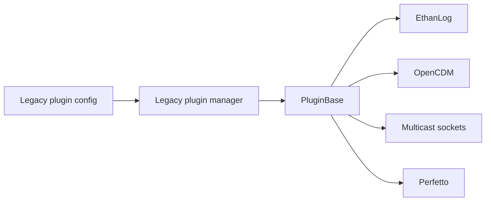
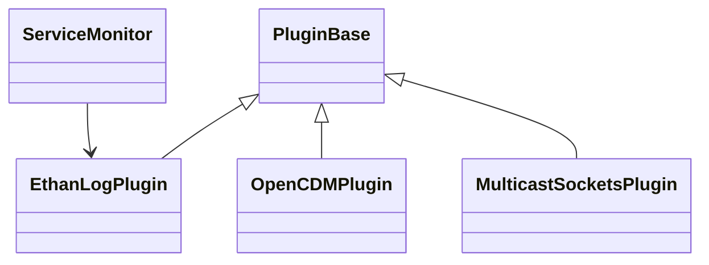
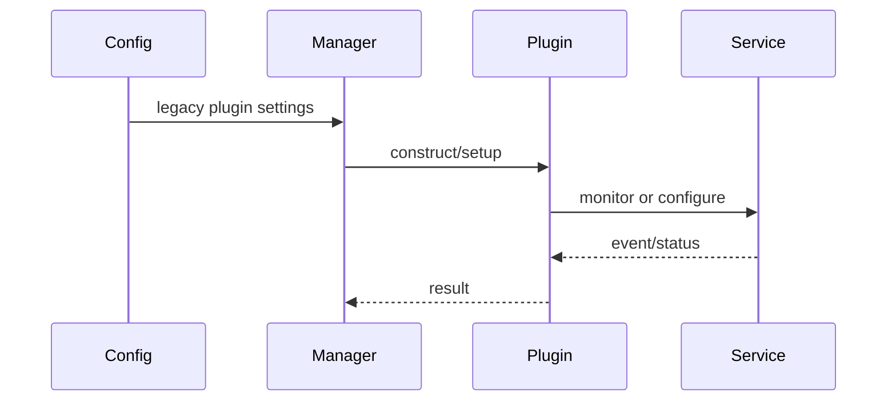
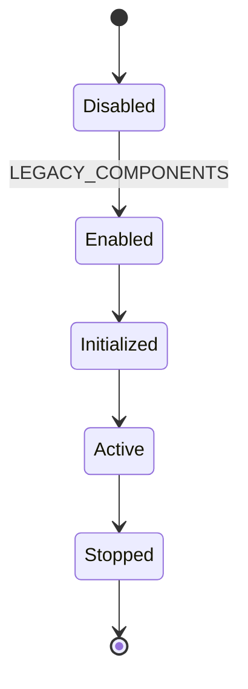

# Legacy Plugins and Shared Plugin Helpers

## 1. High-Level Purpose & Architecture

The `plugins/` tree contains legacy Dobby plugins and shared helpers that predate or complement the RDK plugin launcher. These components extend bundle/container behavior through older plugin configuration paths when legacy support is enabled.

They do not define the modern `IDobbyRdkPlugin` ABI and should not be assumed interchangeable with `rdkPlugins/`.

## 2. Architectural Overview

```text
Legacy spec/config
      |
Dobby legacy plugin manager
      |
plugins/Common PluginBase and ServiceMonitor
      |
EthanLog, OpenCDM, MulticastSockets, Perfetto
```

## 3. Code Organization (Folder & File-Level)

- `plugins/Common/include/PluginBase.h`: shared legacy plugin base.
- `plugins/Common/include/ServiceMonitor.h`, `source/ServiceMonitor.cpp`: service monitoring helper.
- `plugins/EthanLog/source/EthanLogPlugin.*`: EthanLog integration.
- `plugins/EthanLog/source/EthanLogClient.*`, `EthanLogLoop.*`: client and event loop helpers.
- `plugins/EthanLog/client/lib/include/ethanlog.h`, `source/ethanlog.c`: C client API.
- `plugins/EthanLog/client/cat/ethanlog-cat.cpp`: log inspection tool.
- `plugins/OpenCDM/source/OpenCDMPlugin.*`: OpenCDM integration.
- `plugins/MulticastSockets/source/MulticastSocketsPlugin.*`: multicast socket integration.
- `plugins/Perfetto/source/PerfettoPlugin.*`: legacy Perfetto integration.

Some build/runtime interactions are conditional on `LEGACY_COMPONENTS`; exact plugin-specific configuration keys must be read from each plugin source and schema.

## 4. Class & Interface Documentation

`PluginBase` and concrete plugin classes provide the legacy extension point. `ServiceMonitor` observes an external service and is used by components that need service availability. `EthanLogClient` and `EthanLogLoop` isolate the EthanLog transport/event behavior.

No representative snippet is quoted because the inspected central contracts were in the modern launcher and bundle headers; the exact legacy method signatures should be taken from the individual headers before implementation changes.

## 5. Configuration & Build Integration

`LEGACY_COMPONENTS` enables legacy plugins and related template/spec support. Legacy dependencies include ctemplate according to the root build configuration. Perfetto also requires debug tracing support and the Perfetto SDK.

## 6. Internal Workflows & Execution Flow

A legacy-enabled build parses legacy plugin data, constructs the selected plugin/helper, performs setup during the relevant daemon or bundle operation, and releases resources during teardown. The exact hook names and ordering differ from modern RDK plugins and are not fully established by the inspected headers.

## 7. Diagrams & Visual Aids









## 8. Testing & Quality Analysis

The file inventory shows broad daemon and configuration tests but no clearly named test suite for every legacy plugin. Add plugin-specific tests for service disappearance, malformed settings, duplicate cleanup, socket ownership, and builds with `LEGACY_COMPONENTS` both enabled and disabled. Platform services require integration tests.

## 9. Beginner-to-Expert Teaching Mode

**Must know first:** legacy plugins are an older extension path and are compile-time optional.

**Advanced path:** compare legacy plugin ownership and hook timing with `IDobbyRdkPlugin`, then trace configuration compatibility and migration risks.
