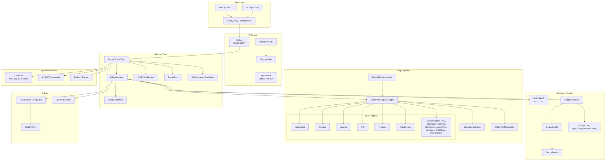
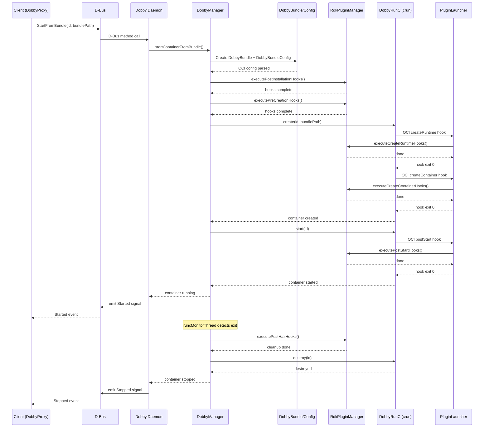
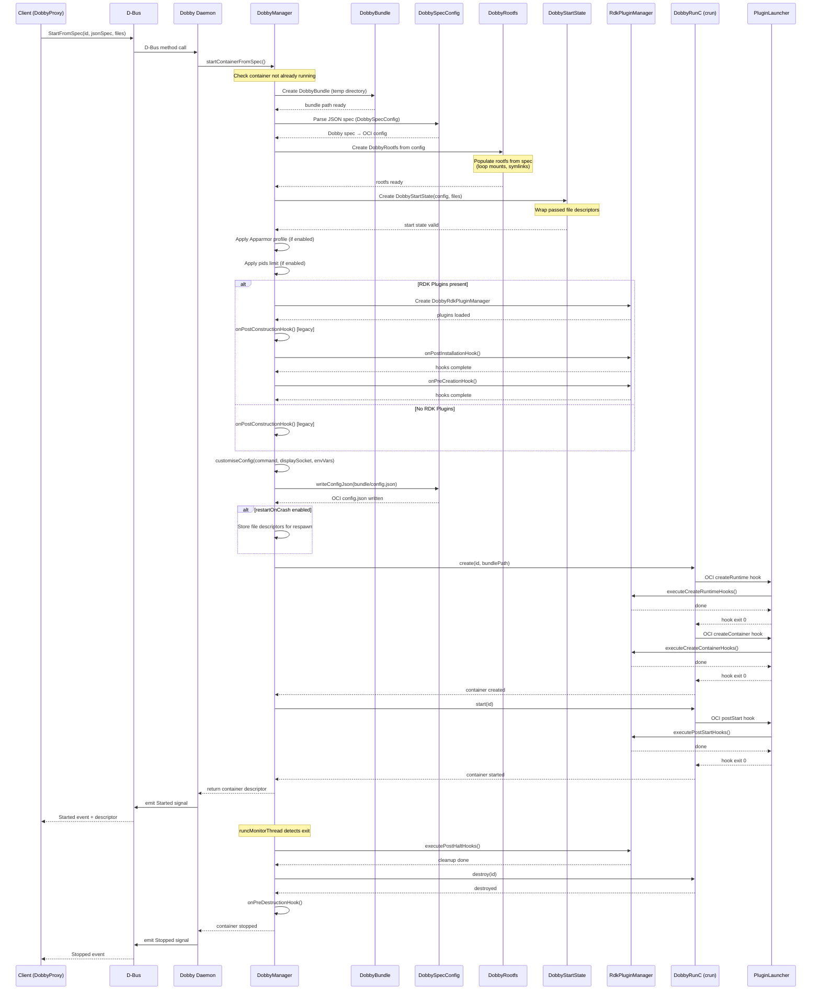
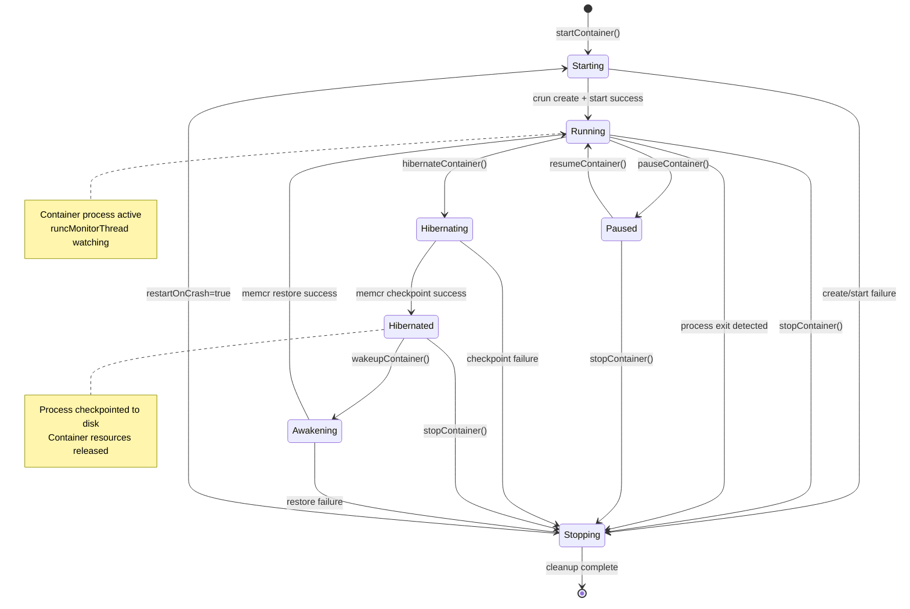
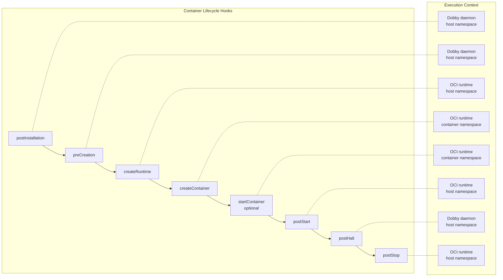

# OpenSpec Coverage Report

**Total Score: 64.50 / 100**

---

## Code to Spec Coverage: 36.00 / 40

| Sub-criterion | Score | Max | Notes |
|---|---|---|---|
| Reference Coverage | 19.00 | 20 | ~95% of source files covered via spec `## Covered Code` sections after adding rdk-plugins-impl.md, app-infrastructure.md, and test-infrastructure.md. |
| Spec Existence | 10.00 | 10 | All 9 referenced specs exist in `openspec/specs/`. |
| Spec Completeness | 5.00 | 5 | All 9 specs contain Overview, Description, and Requirements sections. |
| No Orphaned Code | 5.00 | 5 | Only `bundle/runtime-schemas/` remains — excluded as auto-generated/tooling code. Score: 5.00/5 |

**Adjusted Code to Spec Coverage: 36.00 / 40**

### Remaining Orphaned Code (not covered by any spec)
- `bundle/runtime-schemas/` (runtime JSON schema files and Python schema-extension scripts — excluded as tooling)

---

## Architecture HLA Specification: 9.00 / 10

| Sub-criterion | Score | Max | Notes |
|---|---|---|---|
| Presence of HLA Spec | 2.50 | 3 | Architecture sections exist in each spec. No standalone HLA document, but daemon-core provides comprehensive system-level design. |
| Clarity of Architecture Diagrams | 2.50 | 3 | Mermaid diagrams added: component relationships, data flow, container lifecycle state machine, and plugin architecture. |
| Component/Module Mapping | 2.00 | 2 | All major components mapped: daemon, client, plugins (including all 16 RDK plugin implementations), bundle, IPC/utils, build/settings, AppInfrastructure, tests. |
| Traceability to Code | 2.00 | 2 | Each spec has a `## Covered Code` section mapping components to source files. |

---

## Performance Specification: 3.00 / 10

| Sub-criterion | Score | Max | Notes |
|---|---|---|---|
| Presence of Performance Spec | 1.50 | 3 | Performance sections exist in specs but are brief. No dedicated performance spec. |
| Defined Performance Metrics | 0.50 | 3 | Few measurable metrics defined. No latency/throughput targets. |
| Test Coverage for Performance | 0.50 | 2 | No dedicated performance tests identified. |
| Results & Validation | 0.50 | 2 | No benchmark results or validation data documented. |

---

## External Interface Specification: 6.50 / 10

| Sub-criterion | Score | Max | Notes |
|---|---|---|---|
| Presence of Interface Spec | 3.00 | 3 | D-Bus protocol documented in daemon-core.md. IDobbyProxy, IDobbyUtils, IDobbyRdkPlugin interfaces described. |
| Defined Inputs/Outputs | 2.00 | 3 | Method names listed but parameter types/return values not fully specified for D-Bus methods. |
| Documentation Completeness | 1.00 | 2 | Missing detailed parameter specifications and error codes. |
| Validation/Examples | 0.50 | 2 | DobbyTool as usage example. No formal API examples documented. |

---

## Security Specification: 2.50 / 10

| Sub-criterion | Score | Max | Notes |
|---|---|---|---|
| Presence of Security Spec | 1.50 | 3 | Security sections exist in multiple specs but are brief. |
| Threat Model/Analysis | 0.00 | 3 | **No threat model or security analysis present.** |
| Security Requirements | 1.00 | 2 | Basic requirements mentioned: OCI namespaces, cgroups, seccomp, D-Bus policy. |
| Validation/Testing | 0.00 | 2 | No security-specific tests documented. |

---

## Versioning & Compatibility: 2.00 / 10

| Sub-criterion | Score | Max | Notes |
|---|---|---|---|
| Presence of Versioning Spec | 1.00 | 3 | Build-settings spec mentions `DOBBY_VERSION`. Most specs say "Not applicable." |
| Versioning Scheme Defined | 0.50 | 3 | No explicit semver or versioning scheme documented. |
| Backward/Forward Compatibility | 0.50 | 2 | OCI version compatibility and legacy plugin gating mentioned but not formalized. |
| Migration/Upgrade Path | 0.00 | 2 | No migration guidance documented. |

---

## Conformance Testing Automation and Validation: 5.50 / 10

| Sub-criterion | Score | Max | Notes |
|---|---|---|---|
| Presence of Conformance Tests | 3.00 | 3 | L1/L2 test suites fully documented in test-infrastructure.md with test lists and mock objects. |
| Test Coverage | 1.00 | 3 | Test-to-requirement mapping partially documented. No coverage metrics. |
| Test Documentation | 1.50 | 2 | Build & execution instructions documented. Test architecture diagram included. |
| Validation Results | 0.00 | 2 | No test results tracked or documented. |

---

## Architecture Diagrams

### Component Relationships

### Container Lifecycle Data Flow

### StartFromSpec Data Flow

### Container Lifecycle State Machine

### Plugin Hook Execution Order

---

## Summary & Recommendations

### Strengths
1. **Complete spec coverage of all modules** — 9 specs covering daemon, client, plugins (architecture + implementations), bundle, IPC/utils, build/settings, AppInfrastructure, and test infrastructure.
2. **Excellent component-to-code traceability** — every spec has a `## Covered Code` section; ~95% of source files covered (only auto-generated schemas excluded).
3. **Well-structured specs** — all contain required Overview, Description, and Requirements sections.
4. **Detailed D-Bus protocol documentation** — interfaces, methods, and events enumerated.
5. **Architecture diagrams** — Mermaid diagrams for component relationships, data flow, lifecycle state machine, and plugin hooks.
6. **Test infrastructure documented** — L1 unit tests and L2 integration tests catalogued with mock objects and execution instructions.

### Gaps & Recommendations

| Priority | Gap | Recommendation |
|---|---|---|
| 🔴 High | No threat model | Create a security spec with threat model (STRIDE), attack surface analysis, and mitigation mapping. |
| 🟡 Medium | No versioning scheme | Document semver policy, API stability guarantees, and deprecation process. |
| 🟡 Medium | No test coverage metrics | Add lcov/gcov coverage targets and track results in CI. |
| 🟡 Medium | D-Bus API lacks parameter details | Add parameter types, return values, and error codes for each D-Bus method. |
| 🟡 Medium | No performance targets | Define measurable KPIs (container start latency, memory overhead, max concurrent containers). |
| 🟢 Low | No migration guidance | Document upgrade path from legacy plugins to RDK plugins. |
| 🟢 Low | No validation results | Track and publish test pass/fail results per release. |

---

## Score Breakdown

| Category | Score | Weight | Weighted |
|---|---|---|---|
| Code to Spec Coverage | 36.00/40 | 40% | 36.00 |
| Architecture HLA | 9.00/10 | 10% | 9.00 |
| Performance | 3.00/10 | 10% | 3.00 |
| External Interfaces | 6.50/10 | 10% | 6.50 |
| Security | 2.50/10 | 10% | 2.50 |
| Versioning & Compatibility | 2.00/10 | 10% | 2.00 |
| Conformance Testing | 5.50/10 | 10% | 5.50 |
| **Total** | | | **64.50 / 100** |
