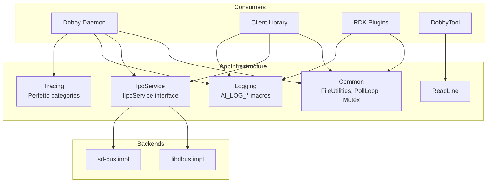

# AppInfrastructure & Tracing Libraries

## Overview
The AppInfrastructure libraries provide shared foundational utilities used across all Dobby components: common data structures, IPC service abstraction, logging framework, readline support, and optional Perfetto-based tracing.

## Description

### Common Library
Shared low-level utilities used by daemon, client, plugins, and IPC layers.

**Key classes:**
- `FileUtilities` — File read/write helpers, path manipulation
- `PollLoop` / `IPollSource` — epoll-based event loop for async I/O
- `ThreadedDispatcher` — Thread-pool based work dispatcher
- `Timer` — Basic timer utility (distinct from DobbyTimer)
- `Mutex` / `ConditionVariable` — RAII thread synchronization wrappers
- `AI_MD5` — MD5 hash computation (C implementation)

### IPC Service Library
D-Bus abstraction layer providing `IIpcService` implementations for both libdbus and sd-bus backends.

**Subdirectories:**
- `common/` — Shared IPC types and helpers
- `libdbus/` — libdbus-based `IIpcService` implementation
- `sdbus/` — sd-bus (systemd) based `IIpcService` implementation

### Logging Library
Leveled logging framework with configurable output backends.

- `AI_LOG_*` macros: Fatal, Error, Warn, Milestone, Info, Debug
- Configurable log printer callback for routing to syslog, journald, or console

### ReadLine Library
Interactive command-line input support used by DobbyTool.

### Tracing Library
Optional Perfetto-based tracing for performance analysis.

- Enabled via `AI_ENABLE_TRACING` / `ENABLE_PERFETTO_TRACING` build flag
- Trace categories: Dobby, Plugins, NatNetwork, Containers
- **File**: `tracing/include/DobbyTraceCategories.h`

## Requirements
- libdbus or libsystemd required for IPC service (selected via `USE_SYSTEMD` flag).
- Perfetto SDK required when tracing is enabled.
- POSIX threads required for Common library synchronization primitives.

## Architecture / Design

## External Interfaces
- **IIpcService**: Abstract D-Bus interface consumed by DobbyIPCUtils and client library.
- **AI_LOG_* macros**: Logging API consumed by all components.
- **IPollSource / PollLoop**: Event-driven I/O interface.

## Performance
- `PollLoop` uses epoll for efficient I/O multiplexing.
- `ThreadedDispatcher` uses a single dedicated dispatcher thread for serialized event processing.

## Security
- Mutex/ConditionVariable wrappers prevent common threading bugs.
- No direct security surface — security enforced by consuming components.

## Versioning & Compatibility
_Follows the overall Dobby project version._

## Conformance Testing & Validation
_Tested as part of overall Dobby L1/L2 test suites._

## Covered Code
- AppInfrastructure/Common/source/FileUtilities.cpp
- AppInfrastructure/Common/source/PollLoop.cpp
- AppInfrastructure/Common/source/ThreadedDispatcher.cpp
- AppInfrastructure/Common/source/Timer.cpp
- AppInfrastructure/Common/source/AI_MD5.c
- AppInfrastructure/IpcService/source/common/
- AppInfrastructure/IpcService/source/libdbus/
- AppInfrastructure/IpcService/source/sdbus/
- AppInfrastructure/Logging/source/Logging.cpp
- tracing/source/
- tracing/include/DobbyTraceCategories.h

---

## Open Queries
_No open queries._

## References
- [ipc-utilities.md](./ipc-utilities.md) — Higher-level IPC and utility wrappers

## Change History
- 2025-05-18 - Created to cover orphaned AppInfrastructure and tracing source files.
