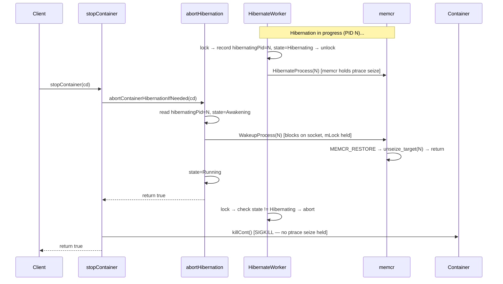

# Proposal: Synchronize Dobby Stop with In-Progress Hibernation

**Ticket**: RDKEMW-13969  
**Status**: Implemented  
**Component**: daemon-core (DobbyManager, DobbyContainer)

---

## Problem Statement

There is no synchronization between `DobbyManager::stopContainer()` and an in-progress `hibernateContainer()` operation. When Stop is invoked while a hibernation is underway, the container processes are killed (SIGKILL/SIGTERM) while `memcr_worker` is still performing checkpoint operations on those PIDs. This causes `memcr_worker` to crash on an assert when it encounters errors operating on terminated processes.

**Impact**: Non-harmful to user experience or memcr stability, but produces misleading crash reports that waste QA investigation time.

---

## Root Cause Analysis

### Current Behavior (before fix)

1. `hibernateContainer()` acquires `mLock`, sets state to `Hibernating`, spawns a **detached** thread, and releases the lock.
2. The hibernation worker thread releases `mLock` during long-running socket I/O with memcr (up to 20s timeout per PID).
3. `stopContainer()` acquires `mLock`, sees the container in `Hibernating` state, and immediately sends SIGKILL — **with no coordination** with the hibernation thread.
4. The hibernation thread continues issuing memcr checkpoint commands against now-dead PIDs, triggering asserts in `memcr_worker`.

### Race Window

```
t0: hibernateContainer() → state = Hibernating, detach worker thread
t1: worker releases mLock, begins memcr socket I/O (per-PID, ~20s timeout)
      ↓ UNPROTECTED WINDOW
t2: stopContainer() acquires mLock, sends SIGKILL
t3: worker's memcr calls fail → memcr_worker assert crash
```

### Existing Abort Mechanism (was not triggered)

The hibernation worker already checks for abort at each per-PID iteration:
```cpp
if (container not found || descriptor mismatch || state != Hibernating) → abort
```
But `stopContainer()` never changed the state away from `Hibernating` before killing — it treated `Hibernating` the same as `Running`.

---

## Solution (Implemented)

The fix has two complementary parts:

1. **`abortContainerHibernationIfNeeded()`** — a new private method that, when called from `stopContainer()`, synchronously drives memcr out of any in-flight checkpoint by sending a `MEMCR_RESTORE` command for the one PID currently being checkpointed. Only that single PID needs waking; fully-checkpointed PIDs from previous iterations are already past memcr's assert-prone path and are safe to SIGKILL directly.
2. **`hibernatingPid` field** — a `uint32_t` tracked in `DobbyContainer`, written under `mLock` immediately before the lock is released for each `HibernateProcess()` call. This lets the abort method read the exact in-flight PID atomically.

### Why the earlier two-part fix (state=Stopping + kill(pid,0)) was insufficient

**memcr's assert fires on a single failed checkpoint**, not only on repeated ones. Inside `execute_blob()` in memcr.c:

```c
assert(WIFSTOPPED(status));   // hard assert — always fires on a killed PID
```

`seize_pid()` treats `ESRCH` as success (logs a message and returns 0), so a dead PID silently passes the seize check and enters `execute_parasite_checkpoint()` where the assert immediately fires.

The `kill(pid, 0)` guard only catches PIDs that are already dead **before** the check — it cannot close the race between passing the check and `ptrace(PTRACE_SEIZE)` beginning inside memcr (a window of microseconds). The `state = Stopping` flag stops the thread from starting new PID iterations, but it cannot interrupt the current in-flight `HibernateProcess()` call. Therefore a race still exists where SIGKILL arrives while memcr holds a ptrace-seize, triggering the assert.

**The only safe approach is to ensure memcr has fully unseized before SIGKILL is sent.**

### Part 1 — `DobbyContainer`: `hibernatingPid` field

```cpp
// PID currently being passed to DobbyHibernate::HibernateProcess.
// Set under mLock before releasing it each iteration of the hibernate thread,
// cleared under mLock when the full hibernation sequence completes.
uint32_t hibernatingPid = 0;
```

In the hibernate thread loop, the assignment happens while the lock is held, immediately before `locker.unlock()`:

```cpp
locker.lock();
if (/* container gone or state != Hibernating */) { return; }
uint32_t pid = pidIt->asUInt();
containerIt->second->hibernatingPid = pid;   // record before releasing lock
locker.unlock();

ret = DobbyHibernate::HibernateProcess(pid, ...);
```

When the full loop completes, `hibernatingPid` is cleared under the lock before the state transition:

```cpp
locker.lock();
// ... container still-alive checks ...
mContainers[id]->hibernatingPid = 0;
if (ret == DobbyHibernate::Error::ErrorNone)
    mContainers[id]->state = DobbyContainer::State::Hibernated;
else
    mContainers[id]->state = DobbyContainer::State::Running;
```

### Part 2 — `abortContainerHibernationIfNeeded(int32_t cd)`

Called by `stopContainer()` when it finds the container in `Hibernating` state. The method:

1. Reads `hibernatingPid` while holding `mLock`.
2. Sets `state = Awakening` — the hibernate thread's per-iteration state check will see a non-`Hibernating` state and abort before starting any further `HibernateProcess()` call.
3. If `hibernatingPid != 0`: calls `DobbyHibernate::WakeupProcess(inflightPid)` (default 20 s timeout) **while holding `mLock`**. The hibernate thread is blocked inside `HibernateProcess()` (a memcr socket call) at this point and does not hold `mLock`, so there is no deadlock risk. `WakeupProcess` sends `MEMCR_RESTORE` to the in-flight worker, which causes it to take the graceful `unseize_target()` + return path rather than proceeding to `execute_blob()`. If `WakeupProcess` fails, state is reverted to `Hibernating` and the method returns `false`.
4. Sets `state = Running` so `killCont()` can proceed.

```cpp
bool DobbyManager::abortContainerHibernationIfNeeded(int32_t cd)
{
    // ... find container (mLock must already be held by the caller) ...

    if (it->second->state != DobbyContainer::State::Hibernating)
        return true;   // nothing to do

    const uint32_t inflightPid = it->second->hibernatingPid;
    it->second->state = DobbyContainer::State::Awakening;

    if (inflightPid != 0)
    {
        // mLock held throughout — hibernate thread is blocked in HibernateProcess(),
        // not holding mLock, so no deadlock risk.
        const DobbyHibernate::Error wakeRet =
            DobbyHibernate::WakeupProcess(static_cast<pid_t>(inflightPid));
        if (wakeRet != DobbyHibernate::Error::ErrorNone)
        {
            it->second->state = DobbyContainer::State::Hibernating;  // revert
            return false;
        }
    }

    it->second->hibernatingPid = 0;
    it->second->state = DobbyContainer::State::Running;
    return true;
}
```

`stopContainer()` calls the method — `mLock` is already held via its own `std::unique_lock`:

```cpp
std::unique_lock<std::mutex> locker(mLock);
// ...
if (container->state == DobbyContainer::State::Hibernating)
{
    if (!abortContainerHibernationIfNeeded(cd))
    {
        AI_LOG_FN_EXIT();
        return false;
    }
}
if (!mRunc->killCont(it->first, withPrejudice ? SIGKILL : SIGTERM)) { ... }
```

### Why only the one in-flight PID

- **Previously-checkpointed PIDs** (completed earlier iterations): memcr has fully unseized them and is waiting in an idle state. They are just frozen processes; SIGKILL delivers normally without memcr involvement.
- **In-flight PID** (current iteration): memcr holds a `ptrace(PTRACE_SEIZE)` on it. Sending SIGKILL while this is active triggers `assert(WIFSTOPPED(status))` inside `execute_blob()`. `WakeupProcess` cleanly drives memcr to `unseize_target()` for this PID before the kill.
- **Future PIDs** (not yet started): state = `Awakening` prevents the thread from starting any further `HibernateProcess()` call.

### Why `Hibernated` is not affected

A fully `Hibernated` container has no active hibernate thread. Its processes are frozen but respond to SIGKILL normally; memcr is not holding any ptrace seize. The `Hibernated` case falls straight through to `killCont()` unchanged.

### State Transition

```
Before (baseline):
  stopContainer() on Hibernating → SIGKILL
  → memcr still holds ptrace seize → assert crash

After (abort path, WakeupProcess succeeds):
  stopContainer() on Hibernating
    → abortContainerHibernationIfNeeded():
        state = Awakening
        WakeupProcess(inflightPid)  [blocks until memcr unseizes]
        state = Running
    → killCont() → SIGKILL
  → all memcr ptrace seizes released before kill; no assert

After (no in-flight PID — hibernatingPid == 0):
  stopContainer() on Hibernating
    → abortContainerHibernationIfNeeded():
        state = Awakening  (thread won't start next PID)
        [no WakeupProcess call needed]
        state = Running
    → killCont()

After (WakeupProcess fails):
  stopContainer() on Hibernating
    → abortContainerHibernationIfNeeded():
        state = Awakening
        WakeupProcess(inflightPid) → error
        state = Hibernating  (reverted)
    → returns false
  → stopContainer() returns false (caller may retry)
```

### Sequence Diagram



---

## Affected Code

| File | Change |
|------|--------|
| `daemon/lib/source/include/DobbyContainer.h` | Add `uint32_t hibernatingPid = 0` public field |
| `daemon/lib/source/DobbyManager.cpp` | Hibernate thread: record/clear `hibernatingPid` under `mLock`. `stopContainer()`: `lock_guard` → `unique_lock`, call `abortContainerHibernationIfNeeded()` for `Hibernating` state. New method `abortContainerHibernationIfNeeded()` (holds `mLock` throughout, no unlock/relock). `WakeupProcess` return value checked in abort, wakeup, and hibernation rollback paths; state reverted to `Hibernating` on failure in the abort path. `stopContainer()` doc comment updated to document blocking behaviour when the container is in `Hibernating` state. |
| `daemon/lib/source/include/DobbyManager.h` | Add private declaration for `abortContainerHibernationIfNeeded(int32_t cd)`. |

---

## Risks & Considerations

- **Stop latency increase**: `WakeupProcess` blocks until memcr finishes unseizing, up to the default 20 s timeout. In practice memcr responds promptly to `MEMCR_RESTORE`. This is a deliberate trade-off: a small latency increase is preferable to memcr crashing and generating a spurious crash report.
- **Backward compatibility**: No D-Bus API change. Behavioral change is internal.
- **`hibernatingPid == 0` race**: If `stopContainer()` reads `hibernatingPid == 0` (thread has not yet set it, or has already cleared it), no `WakeupProcess` call is made. The `state = Awakening` transition still prevents the thread from starting the next `HibernateProcess()` call, so at most one final call may proceed — but in that case the thread will see `state != Hibernating` immediately after and abort before the assert window.
- **Container removed mid-iteration (abort path null-deref fix)**: When the per-PID abort-check fires and the container has been removed from `mContainers` (the `find(id) == end()` branch), `mContainers[id]` must not be used — `operator[]` would insert a null `unique_ptr` and `->hibernatingPid` would crash. The implementation guards the `hibernatingPid = 0` clear with an explicit `find` result check.
- **WakeupProcess failure**: If `WakeupProcess()` returns an error, state is reverted from `Awakening` to `Hibernating` and `abortContainerHibernationIfNeeded()` returns `false`. `stopContainer()` propagates this as a `false` return. The hibernate thread is still running and will complete or fail on its own.
- **No deadlock from holding mLock during WakeupProcess**: `abortContainerHibernationIfNeeded()` holds `mLock` throughout the `WakeupProcess()` call. This is safe because the hibernate thread releases `mLock` before entering `HibernateProcess()` (the memcr socket call) and does not reacquire it until that call returns. The two functions therefore cannot deadlock.
- **`Hibernated` state not affected**: Fully hibernated processes respond to SIGKILL directly; no wakeup needed.

---

## Test Plan

| Test | Description |
|------|-------------|
| Stop during active hibernation | Call hibernate, then immediately stop. Verify no `memcr_worker` crash, container stops cleanly, and `WakeupProcess` is called for the in-flight PID. |
| Stop after hibernation completes (`Hibernated`) | Call hibernate, wait for completion, then stop. Verify container is killed directly with no regression. |
| Stop during wakeup (`Awakening`) | Call wakeup, then immediately stop. Verify container stops cleanly. |
| Stop when `hibernatingPid == 0` | Stop arrives between per-PID iterations (lock held by thread, PID not yet recorded). Verify `state = Awakening` alone prevents the next PID from being checkpointed. |
| `WakeupProcess` timeout/failure | Simulate memcr not responding or returning an error. Verify `stopContainer()` returns `false`, container state is reverted to `Hibernating`, and the hibernate thread can complete on its own. |
| `WakeupProcess` failure in wakeup/rollback paths | Simulate `WakeupProcess` failure in `wakeupContainer` thread loop and `hibernateContainer` rollback loop. Verify a warning is logged but the loop continues attempting all remaining PIDs. |
| Concurrent stop/hibernate races | Stress test with rapid stop/hibernate cycling. Verify no crashes and no stuck states. |

---

## References

- [daemon-core.md](../daemon-core.md) — DobbyManager, DobbyHibernate, container state machine
- [memcr](https://github.com/LibertyGlobal/memcr) — Checkpoint/restore service
