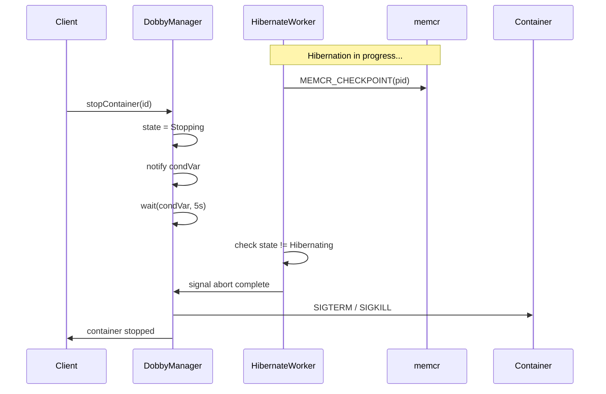

# Proposal: Synchronize Dobby Stop with In-Progress Hibernation

**Ticket**: RDKEMW-13969  
**Status**: Proposed  
**Component**: daemon-core (DobbyManager)

---

## Problem Statement

There is no synchronization between `DobbyManager::stopContainer()` and an in-progress `hibernateContainer()` operation. When Stop is invoked while a hibernation is underway, the container processes are killed (SIGKILL/SIGTERM) while `memcr_worker` is still performing checkpoint operations on those PIDs. This causes `memcr_worker` to crash on an assert when it encounters errors operating on terminated processes.

**Impact**: Non-harmful to user experience or memcr stability, but produces misleading crash reports that waste QA investigation time.

---

## Root Cause Analysis

### Current Behavior

1. `hibernateContainer()` acquires `mLock`, sets state to `Hibernating`, spawns a **detached** thread, and releases the lock.
2. The hibernation worker thread releases `mLock` during long-running socket I/O with memcr (up to 20s timeout per PID).
3. `stopContainer()` acquires `mLock`, sees the container in `Hibernating` state, and immediately sends SIGKILL — **with no coordination** with the hibernation thread.
4. The hibernation thread continues issuing memcr checkpoint commands against now-dead PIDs, triggering asserts in `memcr_worker`.

### Race Window

```
t0: hibernateContainer() → state = Hibernating, detach worker thread
t1: worker releases mLock, begins memcr socket I/O (per-PID, ~20s timeout)
      ↓ UNPROTECTED WINDOW
t2: stopContainer() acquires mLock, sends SIGKILL
t3: worker's memcr calls fail → memcr_worker assert crash
```

### Existing Abort Mechanism (insufficient)

The hibernation worker checks for abort only at one point:
```cpp
if (container not found || state != Hibernating) → abort
```
But `stopContainer()` never changes the state away from `Hibernating` before killing — it treats `Hibernating` the same as `Running`.

---

## Proposed Solution

`stopContainer()` SHALL abort any ongoing hibernation **before** terminating container processes:

### Algorithm

1. **Detect in-progress hibernation**: If container state is `Hibernating`, trigger abort.
2. **Signal abort**: Transition state to `Stopping` (which causes the hibernation worker's state check to detect the abort and return early).
3. **Wait for hibernation worker to exit** (bounded timeout, e.g., 5s).
4. **Proceed with stop**: Send SIGTERM/SIGKILL to container processes as normal.

### Requirements

| ID | Requirement | Priority |
|----|-------------|----------|
| STOP-HIB-001 | `stopContainer()` SHALL detect when a container is in `Hibernating` state and abort the hibernation before killing processes. | Must |
| STOP-HIB-002 | The hibernation worker thread SHALL check container state at each per-PID iteration and abort if state is no longer `Hibernating`. | Must |
| STOP-HIB-003 | `stopContainer()` SHALL wait a bounded time (max 5s) for the hibernation worker to acknowledge the abort before proceeding with kill. | Must |
| STOP-HIB-004 | The hibernation worker thread SHALL be tracked (joinable) rather than detached, to allow orderly cleanup. | Should |
| STOP-HIB-005 | If the hibernation worker does not exit within the timeout, `stopContainer()` SHALL proceed with kill regardless. | Must |
| STOP-HIB-006 | A condition variable or event mechanism SHALL be used to signal between the stop path and hibernation worker. | Should |

### State Transition Change

```
Current:
  stopContainer() on Hibernating → SIGKILL (no state change before kill)

Proposed:
  stopContainer() on Hibernating → state = Stopping → wait for worker abort → SIGKILL
```

### Sequence Diagram



---

## Affected Code

| File | Change |
|------|--------|
| `daemon/lib/source/DobbyManager.cpp` | `stopContainer()`: Add hibernation abort logic before kill |
| `daemon/lib/source/DobbyManager.cpp` | Hibernate worker lambda: Add per-PID state check, use condVar for abort signaling |
| `daemon/lib/source/include/DobbyManager.h` | Add `std::condition_variable` member for hibernate/stop sync |
| `daemon/lib/source/include/DobbyContainer.h` | (Optional) Track hibernate thread as joinable |

---

## Risks & Considerations

- **Stop latency increase**: Bounded to max 5s wait; mitigated by STOP-HIB-005 (proceed regardless on timeout).
- **Backward compatibility**: No D-Bus API change. Behavioral change is internal.
- **Memcr partial checkpoint**: If abort happens mid-checkpoint, incomplete dump files may remain on disk. Cleanup should be handled by existing postHalt or wakeup logic.

---

## Test Plan

| Test | Description |
|------|-------------|
| Stop during active hibernation | Call hibernate, then immediately stop. Verify no memcr_worker crash and container stops cleanly. |
| Stop after hibernation completes | Call hibernate, wait for completion, then stop. Verify no regression. |
| Stop timeout exceeded | Simulate hung hibernation worker. Verify stop proceeds after 5s. |
| Concurrent stop/hibernate races | Stress test with rapid stop/hibernate cycling. Verify no deadlocks or crashes. |

---

## References

- [daemon-core.md](./daemon-core.md) — DobbyManager, DobbyHibernate, container state machine
- [memcr](https://github.com/LibertyGlobal/memcr) — Checkpoint/restore service
