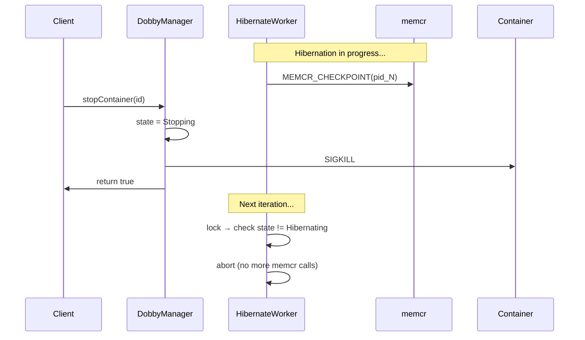

# Proposal: Synchronize Dobby Stop with In-Progress Hibernation

**Ticket**: RDKEMW-13969  
**Status**: Implemented  
**Component**: daemon-core (DobbyManager)

---

## Problem Statement

There is no synchronization between `DobbyManager::stopContainer()` and an in-progress `hibernateContainer()` operation. When Stop is invoked while a hibernation is underway, the container processes are killed (SIGKILL/SIGTERM) while `memcr_worker` is still performing checkpoint operations on those PIDs. This causes `memcr_worker` to crash on an assert when it encounters errors operating on terminated processes.

**Impact**: Non-harmful to user experience or memcr stability, but produces misleading crash reports that waste QA investigation time.

---

## Root Cause Analysis

### Current Behavior (before fix)

1. `hibernateContainer()` acquires `mLock`, sets state to `Hibernating`, spawns a **detached** thread, and releases the lock.
2. The hibernation worker thread releases `mLock` during long-running socket I/O with memcr (up to 20s timeout per PID).
3. `stopContainer()` acquires `mLock`, sees the container in `Hibernating` state, and immediately sends SIGKILL — **with no coordination** with the hibernation thread.
4. The hibernation thread continues issuing memcr checkpoint commands against now-dead PIDs, triggering asserts in `memcr_worker`.

### Race Window

```
t0: hibernateContainer() → state = Hibernating, detach worker thread
t1: worker releases mLock, begins memcr socket I/O (per-PID, ~20s timeout)
      ↓ UNPROTECTED WINDOW
t2: stopContainer() acquires mLock, sends SIGKILL
t3: worker's memcr calls fail → memcr_worker assert crash
```

### Existing Abort Mechanism (was not triggered)

The hibernation worker already checks for abort at each per-PID iteration:
```cpp
if (container not found || descriptor mismatch || state != Hibernating) → abort
```
But `stopContainer()` never changed the state away from `Hibernating` before killing — it treated `Hibernating` the same as `Running`.

---

## Solution (Implemented)

Leverage the existing abort mechanism in the hibernation worker by setting `state = Stopping` **before** sending the kill signal. This is a minimal, non-invasive change:

### Implementation

In `stopContainer()`, when the container is in `Hibernating` state, transition to `Stopping` before calling `killCont()`:

```cpp
// if in Running/Hibernated/Hibernating/Awakening state then use runc to send
// the container's process a signal.
else if (container->state == DobbyContainer::State::Running ||
         container->state == DobbyContainer::State::Hibernating ||
         container->state == DobbyContainer::State::Hibernated ||
         container->state == DobbyContainer::State::Awakening)
{
    // If the container is mid-hibernate, set state to
    // Stopping so the detached hibernate thread will see the
    // state change and abort before sending dead PIDs to memcr
    if (container->state == DobbyContainer::State::Hibernating)
    {
        container->state = DobbyContainer::State::Stopping;
    }

    if (!mRunc->killCont(id, withPrejudice ? SIGKILL : SIGTERM))
    {
        AI_LOG_WARN("failed to send signal to '%s'", id.c_str());
        AI_LOG_FN_EXIT();
        return false;
    }
}
```

### How It Works

1. `stopContainer()` holds `mLock` and sets `state = Stopping`
2. `stopContainer()` sends SIGKILL/SIGTERM and returns
3. On the next per-PID iteration, the hibernation worker acquires `mLock`, sees `state != Hibernating`, logs a warning, and aborts — no further memcr calls on dead PIDs

The worker may still have one in-flight memcr call when the kill happens (the call started before the state change), but that single failure is benign — the assert in memcr_worker is triggered by **repeated** operations on dead PIDs, not a single failed socket call.

### Why only Hibernating (not Awakening)

The `Awakening` state does not need this protection because `WakeupProcess()` on dead PIDs is benign — it simply returns an error without triggering asserts in `memcr_worker`. Only `HibernateProcess()` causes the problematic assert when operating on terminated processes.

### State Transition

```
Before:
  stopContainer() on Hibernating → SIGKILL (state unchanged → worker continues)

After:
  stopContainer() on Hibernating → state = Stopping → SIGKILL (worker aborts on next check)
```

### Sequence Diagram



---

## Affected Code

| File | Change |
|------|--------|
| `daemon/lib/source/DobbyManager.cpp` | `stopContainer()`: Set `state = Stopping` before `killCont()` when container is `Hibernating` |

No header changes, no new members, no new dependencies.

---

## Risks & Considerations

- **No stop latency increase**: The state transition is immediate; no waiting or blocking.
- **Backward compatibility**: No D-Bus API change. Behavioral change is internal.
- **Memcr partial checkpoint**: At most one in-flight memcr call may fail. Incomplete dump files may remain on disk — cleanup handled by existing postHalt logic.
- **Awakening state not affected**: `WakeupProcess()` on dead PIDs is benign (no assert), so no special handling needed for `Awakening`.

---

## Test Plan

| Test | Description |
|------|-------------|
| Stop during active hibernation | Call hibernate, then immediately stop. Verify no memcr_worker crash and container stops cleanly. |
| Stop after hibernation completes | Call hibernate, wait for completion, then stop. Verify no regression. |
| Stop during wakeup | Call wakeup, then immediately stop. Verify container stops cleanly (wakeup calls on dead PIDs are benign). |
| Concurrent stop/hibernate races | Stress test with rapid stop/hibernate cycling. Verify no crashes. |

---

## References

- [daemon-core.md](../daemon-core.md) — DobbyManager, DobbyHibernate, container state machine
- [memcr](https://github.com/LibertyGlobal/memcr) — Checkpoint/restore service
