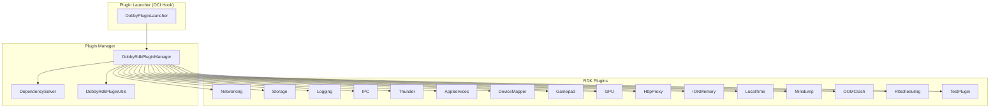

# RDK Plugin Implementations

## Overview
This spec covers the concrete implementations of all built-in RDK plugins shipped with Dobby. Each plugin is a shared library implementing the `IDobbyRdkPlugin` interface (defined in the plugin-system spec) and providing specific container functionality such as networking, storage, logging, and device access.

## Description

### Networking Plugin
Provides container network connectivity with three modes: NAT (default), Open, and None. Manages veth pair creation, bridge interfaces, iptables rules, DNS (dnsmasq), port forwarding, multicast forwarding, and inter-container routing.

**Key classes:**
- `NetworkingPlugin` — Main plugin entry point, orchestrates network setup/teardown
- `Netfilter` — iptables rule management (IPv4/IPv6)
- `NetworkSetup` — veth pair and bridge creation via netlink
- `Netlink` — Low-level netlink socket operations
- `IPAllocator` — Container IP address allocation from configured range
- `DnsmasqSetup` — DNS resolver configuration
- `PortForwarding` — Host-to-container port mapping
- `MulticastForwarder` — Multicast traffic forwarding
- `InterContainerRouting` — Direct routing between containers
- `BridgeInterface` — Bridge device management
- `TapInterface` — TAP device creation for VM containers
- `NetworkingHelper` — Shared utility functions
- `StdStreamPipe` — Pipe management for subprocess I/O

### Storage Plugin
Manages persistent and ephemeral storage for containers via loop-mounted images and dynamic bind mounts.

**Key classes:**
- `Storage` — Main plugin entry point
- `LoopMountDetails` — Loop device image mount configuration
- `DynamicMountDetails` — Runtime bind mount management
- `MountOwnerDetails` — Ownership/permission management for mounts
- `ImageManager` — Ext4 image file creation and validation
- `StorageHelper` — Shared storage utilities
- `RefCountFile` — Reference-counted file tracking for shared mounts

### Logging Plugin
Routes container console output to configurable sinks: file, journald, or /dev/null.

**Key classes:**
- `LoggingPlugin` — Main plugin entry point, poll source registration
- `FileSink` — Log output to rotating files
- `JournaldSink` — Log output to systemd journal
- `NullSink` — Discard log output

### IPC Plugin
Bind-mounts D-Bus sockets (system, session, debug) into containers for IPC access.

**Key classes:**
- `IpcPlugin` — Main plugin entry point

### Thunder Plugin
Provides WPEFramework (Thunder) access by configuring iptables routing to Thunder ports and injecting bearer security tokens.

**Key classes:**
- `ThunderPlugin` — Main plugin entry point

### AppServices Plugin
Configures iptables rules allowing container access to Application Services (AS) listening ports on the host.

**Key classes:**
- `AppServicesRdkPlugin` — Main plugin entry point

### DeviceMapper Plugin
Maps host device nodes into the container with correct major/minor numbers and cgroup device whitelist entries.

**Key classes:**
- `DeviceMapper` — Main plugin entry point

### Gamepad Plugin
Exposes gamepad/joystick input device nodes (`/dev/input/js*`, `/dev/input/event*`) to containers.

**Key classes:**
- `GamepadPlugin` — Main plugin entry point

### GPU Plugin
Configures GPU cgroup memory limits for containers.

**Key classes:**
- `GpuPlugin` — Main plugin entry point

### HttpProxy Plugin
Injects HTTP proxy environment variables and root CA certificates into containers.

**Key classes:**
- `HttpProxyPlugin` — Main plugin entry point

### IONMemory Plugin
Sets ION memory cgroup limits for Android-style raw memory allocation.

**Key classes:**
- `IonMemoryPlugin` — Main plugin entry point

### LocalTime Plugin
Symlinks host `/etc/localtime` into the container rootfs for timezone synchronization.

**Key classes:**
- `LocalTimePlugin` — Main plugin entry point

### Minidump Plugin
Collects crash minidump files from the container namespace and copies them to the host.

**Key classes:**
- `Minidump` — Main plugin entry point
- `AnonymousFile` — memfd-based anonymous file creation for cross-namespace data transfer

### OOMCrash Plugin
Detects OOM kills via cgroup memory events and creates marker files for crash reporting.

**Key classes:**
- `OOMCrashPlugin` — Main plugin entry point

### RtScheduling Plugin
Sets real-time scheduling policy (SCHED_RR or SCHED_FIFO) on the container init process.

**Key classes:**
- `RtSchedulingPlugin` — Main plugin entry point

### TestPlugin
Reference implementation that exercises all hook points for development and testing.

**Key classes:**
- `TestRdkPlugin` — Main plugin entry point

## Requirements
- Standard RDK plugins must implement `IDobbyRdkPlugin` and export `createIDobbyRdkPlugin`/`destroyIDobbyRdkPlugin`.
- The Logging plugin is a special case: it uses `REGISTER_RDK_LOGGER` and exports `createIDobbyRdkLogger`/`destroyIDobbyRdkLogger`.
- Networking plugin requires libnl and libnl-route.
- Storage plugin requires e2fsprogs (mkfs.ext4, e2fsck) for image management.
- Logging plugin journald sink requires libsystemd.
- Plugins are enabled/disabled at build time via `PLUGIN_<NAME>` CMake flags.

## Architecture / Design

## External Interfaces
- **IDobbyRdkPlugin**: Each plugin implements this interface (see plugin-system spec).
- **OCI config.json `rdkPlugins` section**: Per-plugin JSON configuration.
- **Host system APIs**: iptables, netlink, cgroups, loop devices, D-Bus sockets.

## Performance
- Networking plugin: iptables rule setup is O(n) with number of port forwarding rules.
- Storage plugin: loop mount setup involves mkfs on first use (one-time cost).
- All plugins have configurable execution timeouts enforced by the plugin manager.

## Security
- Networking plugin manages iptables firewall rules for container isolation.
- Thunder plugin handles bearer token injection for WPEFramework access control.
- DeviceMapper restricts device access to explicitly mapped nodes only.
- OOMCrash detects resource exhaustion attacks via cgroup events.

## Versioning & Compatibility
- Plugin ABI follows the `IDobbyRdkPlugin` interface version.
- Individual plugins are enabled/disabled via CMake build flags per platform.

## Conformance Testing & Validation
- TestPlugin exercises all hook points as a reference implementation.
- Plugin functionality validated as part of L1/L2 test suites.

## Covered Code
- rdkPlugins/Networking/source/NetworkingPlugin.cpp
- rdkPlugins/Networking/source/Netfilter.cpp
- rdkPlugins/Networking/source/NetworkSetup.cpp
- rdkPlugins/Networking/source/Netlink.cpp
- rdkPlugins/Networking/source/IPAllocator.cpp
- rdkPlugins/Networking/source/DnsmasqSetup.cpp
- rdkPlugins/Networking/source/PortForwarding.cpp
- rdkPlugins/Networking/source/MulticastForwarder.cpp
- rdkPlugins/Networking/source/InterContainerRouting.cpp
- rdkPlugins/Networking/source/BridgeInterface.cpp
- rdkPlugins/Networking/source/TapInterface.cpp
- rdkPlugins/Networking/source/NetworkingHelper.cpp
- rdkPlugins/Networking/source/StdStreamPipe.cpp
- rdkPlugins/Storage/source/Storage.cpp
- rdkPlugins/Storage/source/Storage.h
- rdkPlugins/Storage/source/LoopMountDetails.cpp
- rdkPlugins/Storage/source/LoopMountDetails.h
- rdkPlugins/Storage/source/DynamicMountDetails.cpp
- rdkPlugins/Storage/source/DynamicMountDetails.h
- rdkPlugins/Storage/source/MountOwnerDetails.cpp
- rdkPlugins/Storage/source/MountOwnerDetails.h
- rdkPlugins/Storage/source/ImageManager.cpp
- rdkPlugins/Storage/source/ImageManager.h
- rdkPlugins/Storage/source/StorageHelper.cpp
- rdkPlugins/Storage/source/StorageHelper.h
- rdkPlugins/Storage/source/RefCountFile.cpp
- rdkPlugins/Storage/source/RefCountFile.h
- rdkPlugins/Storage/source/MountProperties.h
- rdkPlugins/Storage/source/RefCountFileLock.h
- rdkPlugins/Logging/source/LoggingPlugin.cpp
- rdkPlugins/Logging/source/LoggingPlugin.h
- rdkPlugins/Logging/source/FileSink.cpp
- rdkPlugins/Logging/source/FileSink.h
- rdkPlugins/Logging/source/JournaldSink.cpp
- rdkPlugins/Logging/source/JournaldSink.h
- rdkPlugins/Logging/source/NullSink.cpp
- rdkPlugins/Logging/source/NullSink.h
- rdkPlugins/IPC/source/IpcPlugin.cpp
- rdkPlugins/IPC/source/IpcPlugin.h
- rdkPlugins/Thunder/source/ThunderPlugin.cpp
- rdkPlugins/Thunder/source/ThunderPlugin.h
- rdkPlugins/AppServices/source/AppServicesRdkPlugin.cpp
- rdkPlugins/AppServices/source/AppServicesRdkPlugin.h
- rdkPlugins/DeviceMapper/source/DeviceMapper.cpp
- rdkPlugins/DeviceMapper/source/DeviceMapper.h
- rdkPlugins/Gamepad/source/GamepadPlugin.cpp
- rdkPlugins/Gamepad/source/GamepadPlugin.h
- rdkPlugins/GPU/source/GpuPlugin.cpp
- rdkPlugins/GPU/source/GpuPlugin.h
- rdkPlugins/HttpProxy/source/HttpProxyPlugin.cpp
- rdkPlugins/HttpProxy/source/HttpProxyPlugin.h
- rdkPlugins/IONMemory/source/IonMemoryPlugin.cpp
- rdkPlugins/IONMemory/source/IonMemoryPlugin.h
- rdkPlugins/LocalTime/source/LocalTimePlugin.cpp
- rdkPlugins/LocalTime/source/LocalTimePlugin.h
- rdkPlugins/Minidump/source/Minidump.cpp
- rdkPlugins/Minidump/source/Minidump.h
- rdkPlugins/Minidump/source/AnonymousFile.cpp
- rdkPlugins/Minidump/source/AnonymousFile.h
- rdkPlugins/OOMCrash/source/OOMCrashPlugin.cpp
- rdkPlugins/OOMCrash/source/OOMCrashPlugin.h
- rdkPlugins/RtScheduling/source/RtSchedulingPlugin.cpp
- rdkPlugins/RtScheduling/source/RtSchedulingPlugin.h
- rdkPlugins/TestPlugin/source/TestRdkPlugin.cpp
- rdkPlugins/TestPlugin/source/TestRdkPlugin.h

---

## Open Queries
_No open queries._

## References
- [plugin-system.md](./plugin-system.md) — Plugin architecture and interfaces
- [OCI Runtime Hooks](https://github.com/opencontainers/runtime-spec/blob/main/config.md#posix-platform-hooks)

## Change History
- 2025-05-18 - Created to cover orphaned RDK plugin implementation source files.
