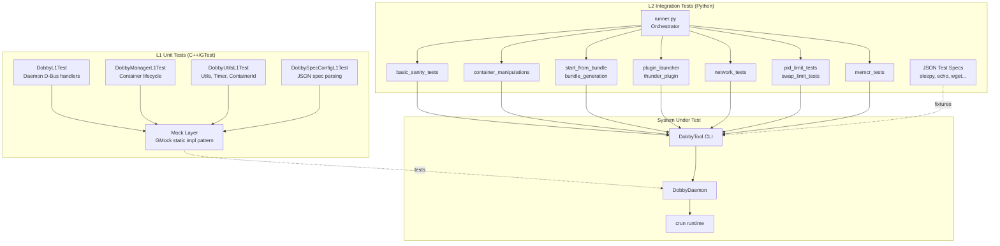
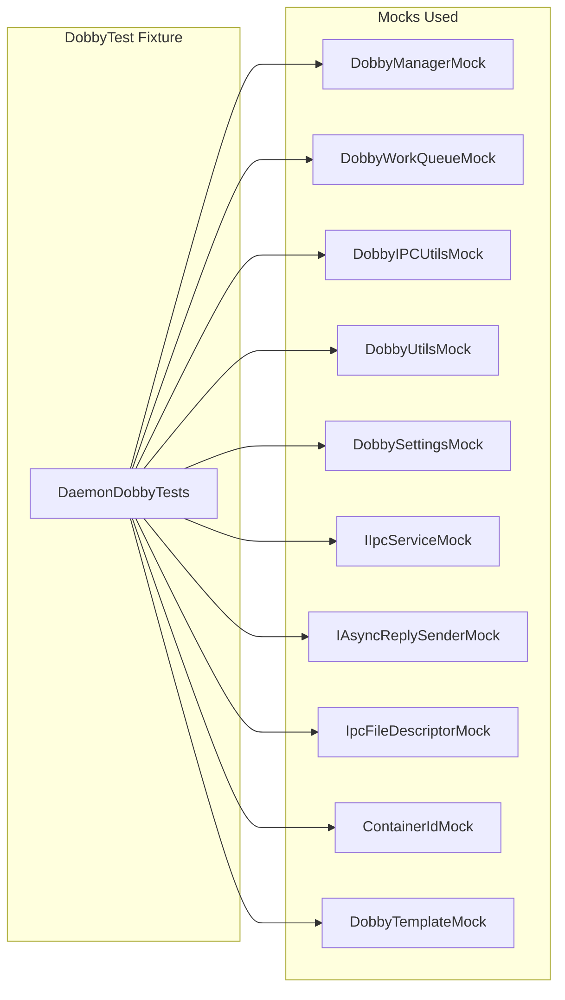
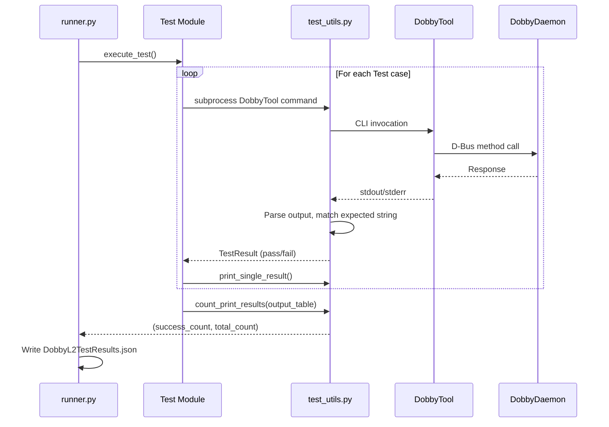

# Test Infrastructure Specification

## Overview

This specification covers the Dobby unit testing and integration testing infrastructure, including L1 (unit) tests using Google Test/Google Mock and L2 (integration/system) tests using a Python-based test runner. The test framework validates the correctness of Dobby's daemon, manager, utilities, and container lifecycle operations.

## Description

### L1 Testing — Unit Tests (C++/GTest)

L1 tests are white-box unit tests that validate individual classes and methods in isolation using mock objects. They use:

- **Google Test (gtest)** — test framework for assertions and test organization
- **Google Mock (gmock)** — mock object framework for dependency injection
- **lcov/gcov** — code coverage instrumentation and reporting

#### Architecture

```
L1 Test Architecture:
┌─────────────────────────────────────────────┐
│  Test Executable (e.g., DobbyL1Test)        │
├─────────────────────────────────────────────┤
│  Test Cases (GTest TEST_F fixtures)         │
├─────────────────────────────────────────────┤
│  Mock Layer (GMock MOCK_METHOD)             │
│  - Replaces real dependencies with mocks    │
│  - Static impl pointer pattern              │
├─────────────────────────────────────────────┤
│  System Under Test (actual Dobby classes)   │
└─────────────────────────────────────────────┘
```

#### Mock Pattern

The L1 tests use a static `impl` pointer pattern:
1. A mock header (e.g., `DobbyContainer.h`) defines an abstract `Impl` class and a concrete class with a `static Impl* impl` member.
2. A `*Mock.h` file defines a GMock class inheriting from the `Impl` interface.
3. A `*Mock.cpp` file provides the concrete class implementation that delegates to `impl->method()`.
4. Test fixtures assign the mock object to the static `impl` pointer before each test.

#### Test Suites

| Suite | File | Tests |
|---|---|---|
| DobbyTest | `DaemonDobbyTests.cpp` | Dobby daemon D-Bus method handlers, container start/stop/pause/resume/hibernate/exec, state listing, event handling |
| DobbyManagerTest | `DaemonDobbyManagerTest.cpp` | DobbyManager container lifecycle, plugin hook invocation, restart-on-crash logic |
| DobbyUtilsTest | `DobbyUtilsTest.cpp` | DobbyUtils loop device management, mount/unmount operations |
| DobbyUtilsTest | `ContainerIdTest.cpp` | ContainerId validation (valid/invalid IDs, max length) |
| DobbyUtilsTest | `DobbyTimerTests.cpp` | DobbyTimer scheduling, cancellation, one-shot/periodic timers |
| DobbySpecConfigTest | `DobbySpecConfigTest.cpp` | JSON spec parsing, OCI config generation, plugin config extraction |

#### Mock Objects

| Mock | Mocked Component | Purpose |
|---|---|---|
| DobbyManagerMock | DobbyManager | Isolate daemon from manager logic |
| DobbyRunCMock | DobbyRunC | Isolate from crun/runc binary |
| DobbyContainerMock | DobbyContainer | Provide fake container state |
| DobbyRdkPluginManagerMock | DobbyRdkPluginManager | Isolate from plugin loading |
| DobbyIPCUtilsMock | DobbyIPCUtils | Isolate from D-Bus |
| DobbyUtilsMock | DobbyUtils | Isolate from filesystem operations |
| DobbySettingsMock | DobbySettings | Provide configurable settings |
| DobbyBundleConfigMock | DobbyBundleConfig | Provide fake OCI config |
| DobbySpecConfigMock | DobbySpecConfig | Provide fake spec config |
| DobbyRootfsMock | DobbyRootfs | Isolate from rootfs creation |
| DobbyStartStateMock | DobbyStartState | Isolate from file descriptor management |
| DobbyHibernateMock | DobbyHibernate | Isolate from memcr |
| DobbyLoggerMock | DobbyLogger | Isolate from log relay |
| DobbyStatsMock | DobbyStats | Provide fake container stats |
| IIpcServiceMock | IIpcService | Isolate from IPC transport |
| IpcFileDescriptorMock | IpcFileDescriptor | Provide fake FD passing |
| IAsyncReplySenderMock | IAsyncReplySender | Verify D-Bus reply construction |
| ContainerIdMock | ContainerId | Provide controlled ID validation |

### L2 Testing — Integration Tests (Python)

L2 tests are black-box integration tests that exercise the Dobby system end-to-end via `DobbyTool` CLI commands. They run against a live `DobbyDaemon` instance and validate container lifecycle operations on a real (or VM) environment.

#### Architecture

```
L2 Test Architecture:
┌─────────────────────────────────────────────┐
│  runner.py (orchestrator)                   │
├─────────────────────────────────────────────┤
│  Test Modules (Python scripts)              │
│  - Each module contains execute_test()      │
│  - Uses test_utils.Test named tuples        │
├─────────────────────────────────────────────┤
│  test_utils.py (framework)                  │
│  - Subprocess execution of DobbyTool        │
│  - Result collection and reporting          │
│  - Platform detection                       │
├─────────────────────────────────────────────┤
│  DobbyTool CLI → DobbyDaemon (D-Bus)       │
├─────────────────────────────────────────────┤
│  Container Runtime (crun)                   │
└─────────────────────────────────────────────┘
```

#### Test Modules

| Module | File | Validates |
|---|---|---|
| Basic Sanity | `basic_sanity_tests.py` | Container start/stop from spec, process listing, state queries |
| Container Manipulations | `container_manipulations.py` | Pause/resume, exec-in-container, multiple concurrent containers |
| Command Line Containers | `command_line_containers.py` | DobbyTool CLI argument handling, output format |
| Start From Bundle | `start_from_bundle.py` | StartFromBundle API path, pre-existing OCI bundles |
| Bundle Generation | `bundle_generation.py` | Dobby spec → OCI bundle conversion |
| Plugin Launcher | `plugin_launcher.py` | OCI hook execution via DobbyPluginLauncher |
| Thunder Plugin | `thunder_plugin.py` | Thunder/WPEFramework plugin integration |
| GUI Containers | `gui_containers.py` | Containers with graphics/display (platform-specific) |
| Network Tests | `network_tests.py` | Networking plugin: bridge setup, NAT, port forwarding |
| PID Limit Tests | `pid_limit_tests.py` | Pids cgroup limiting |
| Memcr Tests | `memcr_tests.py` | Hibernate/wakeup via memcr checkpoint/restore |
| Annotation Tests | `annotation_tests.py` | OCI annotation handling |
| Swap Limit Tests | `swap_limit_tests.py` | Memory/swap cgroup limits |

#### Test Specs (JSON fixtures)

| Spec File | Purpose |
|---|---|
| `sleepy.json` | Long-running container for lifecycle tests |
| `echo.json` | Short-lived container that prints output |
| `envvar.json` | Environment variable passing validation |
| `ram.json` | Memory limit testing |
| `wget.json` / `wget-private.json` | Network connectivity tests |
| `swap_limit.json` / `swap_limit_default.json` | Swap cgroup tests |
| `mounts-*.json` | Platform-specific mount configurations |

### Build & Execution

#### L1 Tests

```bash
# Build with coverage enabled
cmake -DCMAKE_TOOLCHAIN_FILE=tests/L1_testing/gcc-with-coverage.cmake \
      -DRDK_PLATFORM=DEV_VM -DENABLE_DOBBYL1TEST=ON \
      -DCMAKE_BUILD_TYPE=Debug -DPLUGIN_TESTPLUGIN=ON \
      -DPLUGIN_GPU=ON -DPLUGIN_LOCALTIME=ON \
      -DPLUGIN_RTSCHEDULING=ON -DPLUGIN_HTTPPROXY=ON \
      -DPLUGIN_APPSERVICES=ON -DPLUGIN_IONMEMORY=ON \
      -DPLUGIN_DEVICEMAPPER=ON -DPLUGIN_OOMCRASH=ON \
      -DLEGACY_COMPONENTS=ON -DRDK=ON -DUSE_SYSTEMD=ON ..
make -j $(nproc)

# Run test executables
sudo ./build/tests/L1_testing/tests/DobbyTest/DobbyL1Test
sudo ./build/tests/L1_testing/tests/DobbyUtilsTest/DobbyUtilsL1Test
sudo ./build/tests/L1_testing/tests/DobbyManagerTest/DobbyManagerL1Test
sudo ./build/tests/L1_testing/tests/DobbySpecConfigTest/DobbySpecConfigL1Test

# Generate coverage report
lcov -c -o coverage.info -d . && \
lcov -r coverage.info '11/*' '/usr/include/*' '*/tests/L1_testing/tests/*' -o filtered_coverage.info && \
genhtml -o coverage -t "dobby coverage" filtered_coverage.info
```

#### L2 Tests

```bash
# Run all integration tests
python3 tests/L2_testing/test_runner/runner.py -v 3 -p 1

# Run individual test module
python3 tests/L2_testing/test_runner/basic_sanity_tests.py -p 1

# Verbosity: 0=none, 1=error, 2=warning, 3=info, 4=debug, 5=all
# Platform: 0=no_selection, 1=vagrant_vm, 2=xi_6, 3=github_workflow_vm
```

### Test-to-Requirement Mapping

| Requirement Area | L1 Coverage | L2 Coverage |
|---|---|---|
| Container Start (spec) | DobbyTest, DobbyManagerTest | basic_sanity_tests, command_line_containers |
| Container Start (bundle) | DobbyManagerTest | start_from_bundle |
| Container Stop | DobbyTest, DobbyManagerTest | basic_sanity_tests |
| Container Pause/Resume | DobbyTest, DobbyManagerTest | container_manipulations |
| Container Hibernate/Wakeup | DobbyTest | memcr_tests |
| Container Exec | DobbyTest | container_manipulations |
| Plugin Hooks | DobbyManagerTest | plugin_launcher |
| Networking Plugin | — | network_tests |
| Thunder Plugin | — | thunder_plugin |
| Spec Config Parsing | DobbySpecConfigTest | bundle_generation |
| Utils (loop devices, mounts) | DobbyUtilsTest | — |
| Timer Management | DobbyTimerTests | — |
| Container ID Validation | ContainerIdTest | — |
| PID Limits | — | pid_limit_tests |
| Memory/Swap Limits | — | swap_limit_tests |
| OCI Annotations | — | annotation_tests |

## Requirements

### REQ-TEST-001: Unit Test Framework
- All L1 tests SHALL use Google Test (gtest) as the test framework.
- All L1 tests SHALL use Google Mock (gmock) for mock object creation.
- All mocks SHALL follow the static `impl` pointer delegation pattern.

### REQ-TEST-002: Unit Test Coverage
- L1 tests SHALL cover the Dobby daemon D-Bus interface handlers.
- L1 tests SHALL cover the DobbyManager container lifecycle methods.
- L1 tests SHALL cover DobbyUtils filesystem/mount operations.
- L1 tests SHALL cover DobbySpecConfig JSON parsing.
- L1 tests SHALL cover ContainerId validation logic.
- L1 tests SHALL cover DobbyTimer scheduling logic.

### REQ-TEST-003: Integration Test Framework
- L2 tests SHALL be written in Python 3 using only standard library modules.
- L2 tests SHALL use `DobbyTool` CLI as the primary interface to the daemon.
- L2 tests SHALL support platform selection (VM, xi6, GitHub workflow).
- L2 tests SHALL produce JSON test results (`DobbyL2TestResults.json`).

### REQ-TEST-004: Integration Test Coverage
- L2 tests SHALL validate container start from both spec and bundle paths.
- L2 tests SHALL validate container stop, pause, resume operations.
- L2 tests SHALL validate hibernate/wakeup (memcr) operations.
- L2 tests SHALL validate networking plugin (bridge, NAT, port forwarding).
- L2 tests SHALL validate resource limiting (PIDs, memory, swap).
- L2 tests SHALL validate OCI annotation handling.
- L2 tests SHALL validate plugin launcher hook execution.

### REQ-TEST-005: Test Execution
- L1 tests SHALL be executable as standalone binaries with `sudo`.
- L2 tests SHALL be executable individually or via `runner.py` orchestrator.
- Both L1 and L2 tests SHALL be integrated into CI/CD via GitHub Actions (`.github/workflows/L1-tests.yml` and `.github/workflows/L2-tests.yml`).

### REQ-TEST-006: Coverage Reporting
- L1 tests SHALL support lcov/gcov coverage instrumentation.
- Coverage reports SHALL exclude test code, system headers, and third-party code.
- Coverage reports SHALL be generated in HTML format.

## Covered Code

### L1 Test Files
- `tests/L1_testing/tests/DobbyTest/DaemonDobbyTests.cpp`
- `tests/L1_testing/tests/DobbyManagerTest/DaemonDobbyManagerTest.cpp`
- `tests/L1_testing/tests/DobbyUtilsTest/DobbyUtilsTest.cpp`
- `tests/L1_testing/tests/DobbyUtilsTest/ContainerIdTest.cpp`
- `tests/L1_testing/tests/DobbyUtilsTest/DobbyTimerTests.cpp`
- `tests/L1_testing/tests/DobbySpecConfigTest/DobbySpecConfigTest.cpp`
- `tests/L1_testing/tests/DobbySpecConfigTest/DobbySpecConfigLinkStubs.cpp`
- `tests/L1_testing/tests/CMakeLists.txt`
- `tests/L1_testing/tests/DobbyTest/CMakeLists.txt`
- `tests/L1_testing/tests/DobbyManagerTest/CMakeLists.txt`
- `tests/L1_testing/tests/DobbyUtilsTest/CMakeLists.txt`
- `tests/L1_testing/tests/DobbySpecConfigTest/CMakeLists.txt`
- `tests/L1_testing/CMakeLists.txt`
- `tests/L1_testing/gcc-with-coverage.cmake`

### L1 Mock Files
- `tests/L1_testing/mocks/DobbyManagerMock.h`
- `tests/L1_testing/mocks/DobbyManagerMock.cpp`
- `tests/L1_testing/mocks/DobbyRunCMock.h`
- `tests/L1_testing/mocks/DobbyRunCMock.cpp`
- `tests/L1_testing/mocks/DobbyContainerMock.h`
- `tests/L1_testing/mocks/DobbyContainerMock.cpp`
- `tests/L1_testing/mocks/DobbyContainer.h`
- `tests/L1_testing/mocks/DobbyRdkPluginManagerMock.h`
- `tests/L1_testing/mocks/DobbyRdkPluginManager.h`
- `tests/L1_testing/mocks/DobbyIPCUtilsMock.h`
- `tests/L1_testing/mocks/DobbyIPCUtilsMock.cpp`
- `tests/L1_testing/mocks/DobbyUtilsMock.h`
- `tests/L1_testing/mocks/DobbyUtilsMock.cpp`
- `tests/L1_testing/mocks/DobbySettingsMock.h`
- `tests/L1_testing/mocks/DobbySettingsMock.cpp`
- `tests/L1_testing/mocks/DobbyBundleConfigMock.h`
- `tests/L1_testing/mocks/DobbyBundleConfigMock.cpp`
- `tests/L1_testing/mocks/DobbySpecConfig.h`
- `tests/L1_testing/mocks/DobbySpecConfigMock.h`
- `tests/L1_testing/mocks/DobbySpecConfigMock.cpp`
- `tests/L1_testing/mocks/DobbyConfigMock.h`
- `tests/L1_testing/mocks/DobbyRootfsMock.h`
- `tests/L1_testing/mocks/DobbyRootfsMock.cpp`
- `tests/L1_testing/mocks/DobbyStartState.h`
- `tests/L1_testing/mocks/DobbyStartStateMock.h`
- `tests/L1_testing/mocks/DobbyStartStateMock.cpp`
- `tests/L1_testing/mocks/DobbyHibernateMock.h`
- `tests/L1_testing/mocks/DobbyHibernateMock.cpp`
- `tests/L1_testing/mocks/DobbyLogger.h`
- `tests/L1_testing/mocks/DobbyLoggerMock.h`
- `tests/L1_testing/mocks/DobbyStatsMock.h`
- `tests/L1_testing/mocks/DobbyStatsMock.cpp`
- `tests/L1_testing/mocks/DobbyTemplateMock.h`
- `tests/L1_testing/mocks/DobbyTemplateMock.cpp`
- `tests/L1_testing/mocks/DobbyEnvMock.h`
- `tests/L1_testing/mocks/DobbyEnvMock.cpp`
- `tests/L1_testing/mocks/DobbyRdkPluginUtils.h`
- `tests/L1_testing/mocks/DobbyRdkPluginUtilsMock.h`
- `tests/L1_testing/mocks/DobbyRdkPluginUtilsMock.cpp`
- `tests/L1_testing/mocks/IIpcService.h`
- `tests/L1_testing/mocks/IIpcServiceMock.h`
- `tests/L1_testing/mocks/IpcFileDescriptorMock.h`
- `tests/L1_testing/mocks/IpcFileDescriptorMock.cpp`
- `tests/L1_testing/mocks/IAsyncReplySenderMock.h`
- `tests/L1_testing/mocks/IAsyncReplySenderMock.cpp`
- `tests/L1_testing/mocks/ContainerId.h`
- `tests/L1_testing/mocks/ContainerIdMock.h`
- `tests/L1_testing/mocks/ContainerIdMock.cpp`
- `tests/L1_testing/mocks/DobbyWorkQueue.h`
- `tests/L1_testing/mocks/DobbyWorkQueueMock.h`
- `tests/L1_testing/mocks/DobbyWorkQueueMock.cpp`
- `tests/L1_testing/mocks/IpcVariantList.h`
- `tests/L1_testing/mocks/DobbyProtocol.h`

### L2 Test Runner Files
- `tests/L2_testing/test_runner/runner.py`
- `tests/L2_testing/test_runner/test_utils.py`
- `tests/L2_testing/test_runner/basic_sanity_tests.py`
- `tests/L2_testing/test_runner/container_manipulations.py`
- `tests/L2_testing/test_runner/command_line_containers.py`
- `tests/L2_testing/test_runner/start_from_bundle.py`
- `tests/L2_testing/test_runner/bundle_generation.py`
- `tests/L2_testing/test_runner/plugin_launcher.py`
- `tests/L2_testing/test_runner/thunder_plugin.py`
- `tests/L2_testing/test_runner/gui_containers.py`
- `tests/L2_testing/test_runner/network_tests.py`
- `tests/L2_testing/test_runner/pid_limit_tests.py`
- `tests/L2_testing/test_runner/memcr_tests.py`
- `tests/L2_testing/test_runner/annotation_tests.py`
- `tests/L2_testing/test_runner/swap_limit_tests.py`

### L2 Test Specs (JSON fixtures)
- `tests/L2_testing/dobby_specs/sleepy.json`
- `tests/L2_testing/dobby_specs/echo.json`
- `tests/L2_testing/dobby_specs/envvar.json`
- `tests/L2_testing/dobby_specs/ram.json`
- `tests/L2_testing/dobby_specs/wget.json`
- `tests/L2_testing/dobby_specs/wget-private.json`
- `tests/L2_testing/dobby_specs/swap_limit.json`
- `tests/L2_testing/dobby_specs/swap_limit_default.json`
- `tests/L2_testing/dobby_specs/mounts-vagrant-vm.json`
- `tests/L2_testing/dobby_specs/mounts-xi6.json`
- `tests/L2_testing/dobby_specs/mounts-github-workflow-vm.json`

## Diagrams

### Test Architecture Overview



### L1 Mock Dependency Graph



### L2 Test Execution Flow


