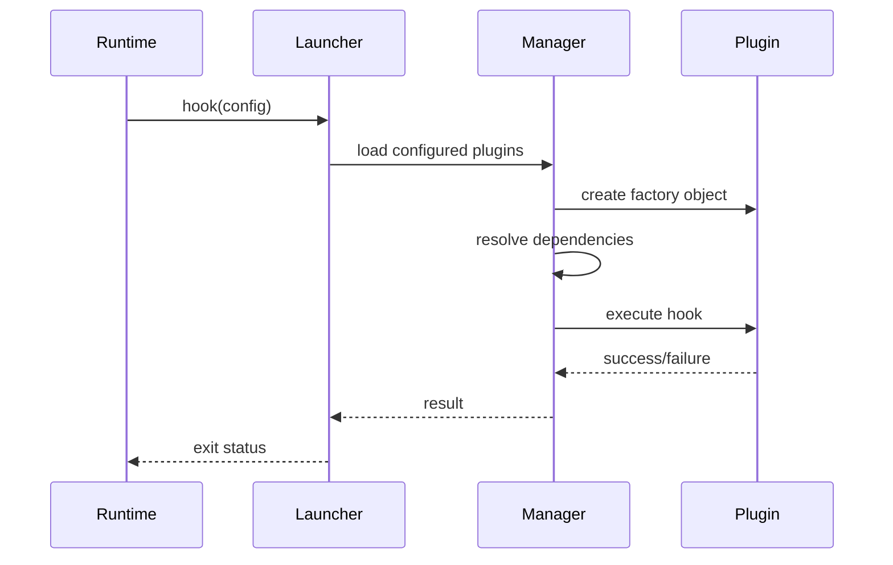
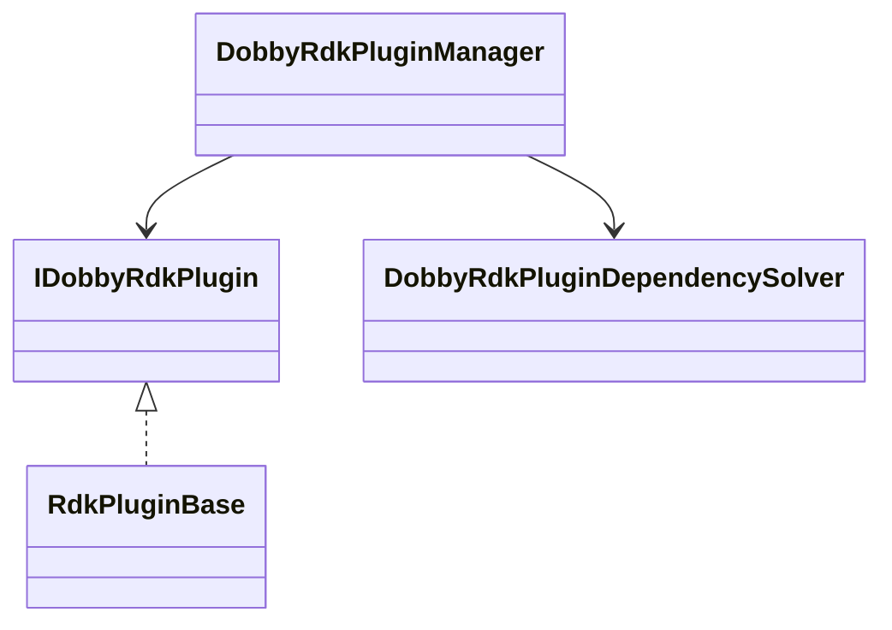
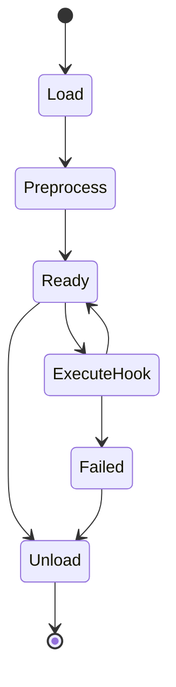
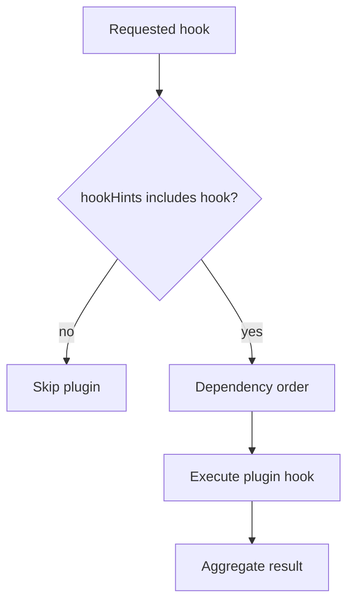

# RDK Plugin Launcher Subsystem

## 1. High-Level Purpose & Architecture

The plugin launcher loads RDK plugin shared libraries and runs their lifecycle hooks at the hook point requested by Dobby or the OCI runtime. It is the runtime adapter between an OCI bundle's plugin configuration and platform-specific RDK behavior.

It does not decide generic container lifecycle policy; the daemon and runtime do that. It also does not define each plugin's hardware behavior.

## 2. Architectural Overview

```text
OCI hook invocation
        |
DobbyPluginLauncher
        |
DobbyRdkPluginManager
   /       |        \
load   dependency   execute
.so    solver       hooks
        |
 IDobbyRdkPlugin implementations
```

## 3. Code Organization (Folder & File-Level)

- `pluginLauncher/tool/source/Main.cpp`: launcher executable entry and hook argument handling.
- `pluginLauncher/lib/include/IDobbyRdkPlugin.h`: plugin ABI and hook contract.
- `pluginLauncher/lib/include/DobbyRdkPluginManager.h`: loading and execution manager.
- `pluginLauncher/lib/include/DobbyRdkPluginUtils.h`: utility API exposed to plugins.
- `pluginLauncher/lib/include/IDobbyRdkLoggingPlugin.h`: logging plugin contract.
- `pluginLauncher/lib/source/DobbyRdkPluginManager.cpp`: library loading and hook execution.
- `pluginLauncher/lib/source/DobbyRdkPluginDependencySolver.cpp`: dependency ordering.
- `pluginLauncher/lib/source/DobbyRdkPluginUtils.cpp`: utility implementation.

## 4. Class & Interface Documentation

### `IDobbyRdkPlugin`

Plugins provide a stable `name()`, a constant `hookHints()` bitmask, lifecycle hook methods, and `getDependencies()`. The available hooks include post-installation, pre-creation, create-runtime, create-container, optional start-container, post-start, post-halt, and post-stop.

Excerpt from [pluginLauncher/lib/include/IDobbyRdkPlugin.h](lib/include/IDobbyRdkPlugin.h):

```cpp
virtual std::string name() const = 0;
virtual unsigned hookHints() const = 0;
virtual std::vector<std::string> getDependencies() const = 0;
```

`REGISTER_RDK_PLUGIN` exports C-linkage create/destroy functions so a shared-library loader can find them without C++ name mangling.

### `DobbyRdkPluginManager`

The manager loads libraries at construction, preprocesses configuration, resolves dependencies, runs hooks, exposes loaded-plugin lists, and returns an optional container logger. It stores native library handles alongside plugin objects.

## 5. Configuration & Build Integration

`PLUGIN_PATH` controls the shared-library search directory and defaults to `/usr/lib/plugins/dobby` in the documented build configuration. `USE_STARTCONTAINER_HOOK` adds the optional hook to the interface. External schemas are passed through `EXTERNAL_PLUGIN_SCHEMA` and generated into the runtime schema.

## 6. Internal Workflows & Execution Flow

1. Launcher parses hook and OCI config arguments.
2. Manager loads configured libraries from the plugin path.
3. Plugin factories create objects with schema, utilities, and rootfs path.
4. Dependency solver orders plugins.
5. Manager checks `hookHints()` and executes only implemented hooks.
6. Hook failure becomes launcher failure; cleanup releases plugin objects and library handles.

The precise timeout and required-plugin semantics are implemented in `DobbyRdkPluginManager.cpp`; inspect that source before relying on edge-case behavior.

## 7. Diagrams & Visual Aids









## 8. Testing & Quality Analysis

L1 tests include plugin manager mocks used by daemon tests. Suggested dedicated tests cover missing symbols, duplicate names, dependency cycles, optional versus required plugins, hook hint mismatches, timeout cancellation, and library unload ordering. No complete launcher integration test was identified in the inspected file inventory.

## 9. Beginner-to-Expert Teaching Mode

**Must know first:** a plugin is a shared library implementing a fixed hook contract; the launcher loads it and invokes selected hooks.

**Advanced path:** study ABI visibility, factory registration, dependency sorting, timeout behavior, logging-plugin separation, and schema compatibility across launcher and plugins.
