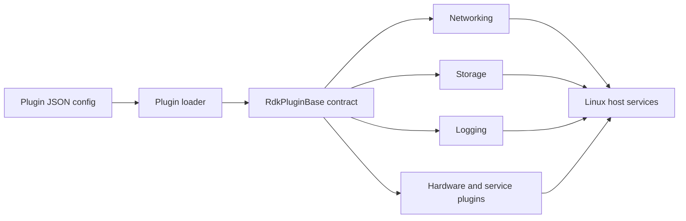
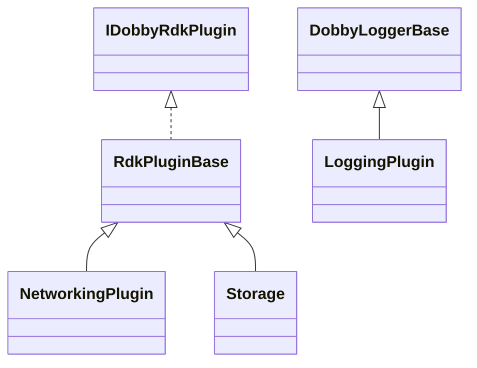
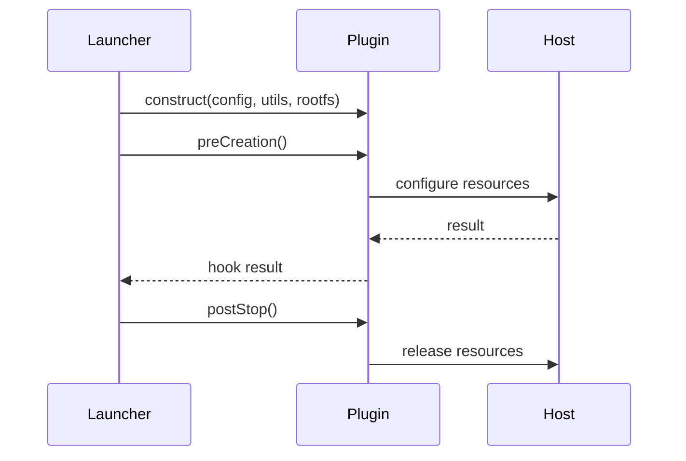
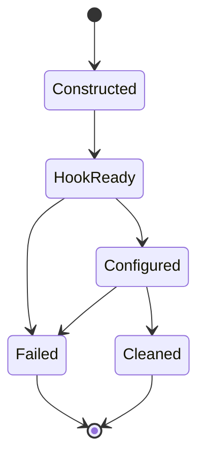

# RDK Plugin Subsystem

## 1. High-Level Purpose & Architecture

RDK plugins provide platform integrations such as networking, storage, logging, IPC, GPU/VPU access, scheduling, minidumps, and application services. They run at lifecycle hooks selected by the plugin launcher.

They do not own the daemon's generic container state machine or the D-Bus transport. Each plugin should keep construction lightweight and perform setup in hooks.

## 2. Architectural Overview

```text
Dobby config/schema
        |
Plugin launcher -> RdkPluginBase
        |
+ networking + storage + logging + IPC + hardware plugins
        |
Linux namespaces, devices, mounts, host services
```

## 3. Code Organization (Folder & File-Level)

- `rdkPlugins/Common/include/RdkPluginBase.h`: default-success hook implementations.
- `rdkPlugins/Common/include/DobbyLoggerBase.h`: shared logging base.
- `rdkPlugins/Networking/`: bridge, netlink, netfilter, IP allocation, DNS, forwarding, and plugin orchestration.
- `rdkPlugins/Storage/`: image, loop mount, dynamic mount, ownership, locking, and storage helpers.
- `rdkPlugins/Logging/`: logging plugin plus journald, file, and null sinks.
- `rdkPlugins/IPC/`: container IPC plugin.
- `rdkPlugins/GPU/`, `IONMemory/`, `DeviceMapper/`, `RtScheduling/`: hardware/resource and scheduling hooks.
- `rdkPlugins/AppServices/`, `Thunder/`, `Gamepad/`, `LocalTime/`, `HttpProxy/`, `OOMCrash/`, `Minidump/`: platform service integrations.
- `rdkPlugins/TestPlugin/`: test/example plugin.

Each plugin generally has a `source/<Plugin>.h` and `.cpp`; complex plugins add helpers listed above. Exact per-plugin parameters are defined in their source and schema files and are not duplicated here.

## 4. Class & Interface Documentation

### `RdkPluginBase`

`RdkPluginBase` implements unused hooks as success and supplies an empty dependency list. A concrete plugin must implement `name()` and `hookHints()` and override only the hooks it needs.

Excerpt from [rdkPlugins/Common/include/RdkPluginBase.h](Common/include/RdkPluginBase.h):

```cpp
virtual bool preCreation()
{
    return true;
};
```

### Concrete plugins

`NetworkingPlugin`, `Storage`, `LoggingPlugin`, `IpcPlugin`, `GpuPlugin`, `IonMemoryPlugin`, and other concrete classes adapt configuration to host operations. Their lifecycle, members, and dependencies vary; the source headers are authoritative. The available inventory does not justify claiming one common member layout.

## 5. Configuration & Build Integration

Plugin build options are named `PLUGIN_<PLUGINNAME>` and plugin schemas are generated through libocispec. The common build contract requires matching CMake registration, CI flags, and coverage flags when adding a plugin. `USE_STARTCONTAINER_HOOK` changes the public hook contract.

## 6. Internal Workflows & Execution Flow

1. Bundle configuration declares an RDK plugin and its JSON settings.
2. Launcher constructs the plugin with schema, utilities, and rootfs path.
3. The plugin's `hookHints()` selects lifecycle points.
4. Setup occurs in the selected hook, with resources recorded by the plugin.
5. Teardown occurs in a later hook or destructor according to the plugin's contract.
6. Failures are returned to the launcher and should be logged with container/plugin context.

Resource ordering and cleanup are plugin-specific. Read the concrete plugin implementation before modifying lifecycle behavior.

## 7. Diagrams & Visual Aids









## 8. Testing & Quality Analysis

`rdkPlugins/TestPlugin` provides a plugin test surface, while L1 tests contain mocks for plugin managers and utilities. Coverage should be expanded per plugin for invalid schema, partial host setup, rollback, namespace failures, resource leaks, dependency ordering, and repeated hooks. Platform-specific behavior cannot be validated from source inspection alone.

## 9. Beginner-to-Expert Teaching Mode

**Must know first:** each plugin is an independent lifecycle participant with a declared name, hooks, and configuration.

**Advanced path:** learn hook namespace/timing semantics, dependency ordering, Linux resource ownership, schema generation, and rollback across multi-plugin startup.
