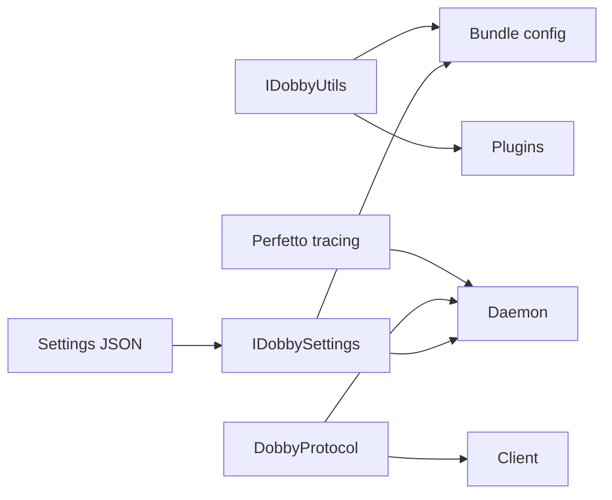
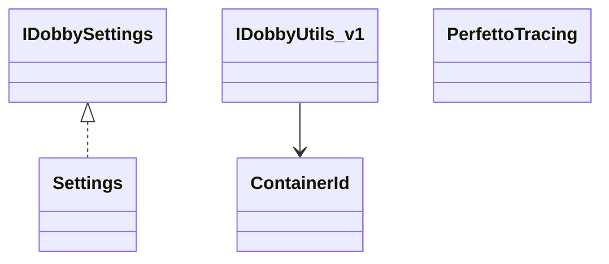
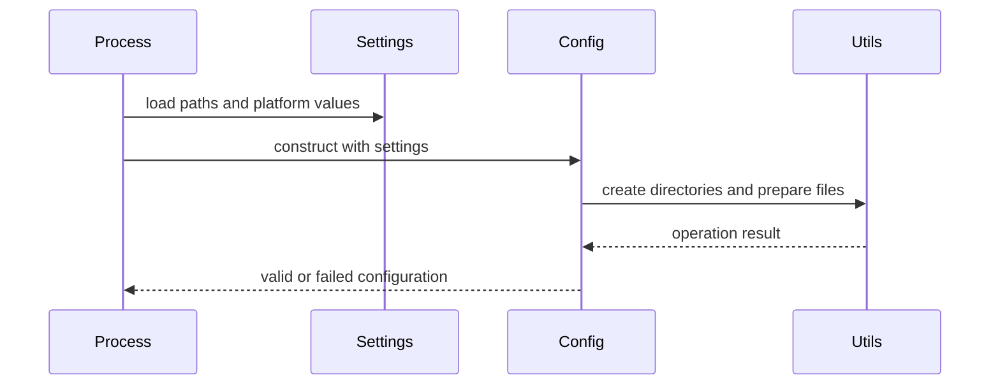
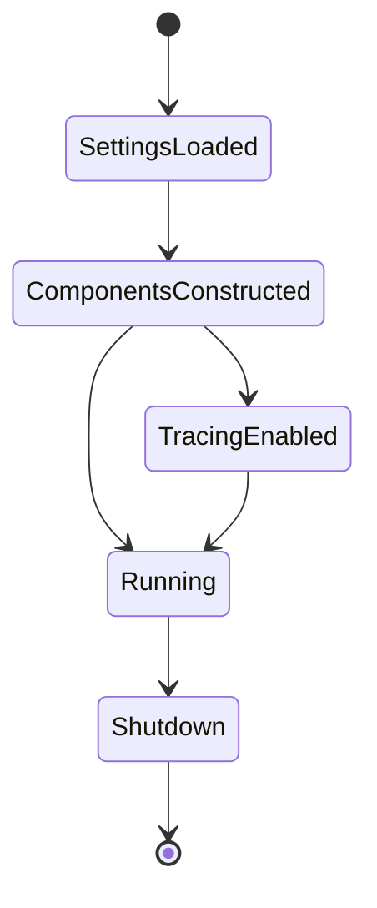

# Settings, Utilities, Tracing, and Protocol Components

## 1. High-Level Purpose & Architecture

These smaller components supply cross-cutting contracts: settings expose platform paths and hardware access, utilities wrap filesystem/Linux operations, tracing adds optional Perfetto instrumentation, and protocol headers centralize D-Bus names and state constants.

They do not replace the daemon, IPC transport, or plugin manager.

## 2. Architectural Overview

```text
Settings --> daemon/config/plugins
Utils ----> bundle/daemon/plugins
Protocol -> client/daemon/IPC names
Tracing --> daemon/plugin diagnostics
```

## 3. Code Organization (Folder & File-Level)

- `settings/include/IDobbySettings.h`, `Settings.h`: settings contracts and implementation.
- `settings/source/Settings.cpp`: JSON/settings loading.
- `utils/include/IDobbyUtils.h`, `DobbyUtils.h`, `IDobbyEnv.h`, `ContainerId.h`, `DobbyFileAccessFixer.h`: utility/environment contracts.
- `utils/source/DobbyUtils.cpp`, `ContainerId.cpp`, `DobbyTimer.cpp`, `DobbyFileAccessFixer.cpp`: implementations.
- `tracing/include/PerfettoTracing.h`, `DobbyTraceCategories.h`; `tracing/source/PerfettoTracing.cpp`, `PerfettoTracingSingleton.*`: optional tracing.
- `protocol/include/DobbyProtocol.h`: D-Bus interface, method, event, state, and log constants.

## 4. Class & Interface Documentation

### `IDobbySettings`

The settings interface provides workspace and persistent paths, extra environment variables, console socket path, GPU/VPU access settings, external interfaces, and the Dobby address range. `HardwareAccessSettings` groups device nodes, supplementary groups, mounts, and environment.

Excerpt from [settings/include/IDobbySettings.h](include/IDobbySettings.h):

```cpp
virtual std::string workspaceDir() const = 0;
virtual std::shared_ptr<HardwareAccessSettings> gpuAccessSettings() const = 0;
```

### `IDobbyUtils_v1`

The utility contract wraps recursive directory operations, loop-device association, image checks, and other Linux operations exposed to plugins. `ContainerId` provides container identity handling; `DobbyTimer` and `DobbyFileAccessFixer` cover focused helpers.

### `DobbyProtocol`

The protocol header defines service/object defaults, admin/control/debug method names, lifecycle event names, state integers, and logging constants. It is a compile-time contract shared by client and daemon.

### Tracing

`PerfettoTracing` and its singleton provide optional instrumentation. Top-level CMake enables it only for debug builds with `ENABLE_PERFETTO_TRACING` and a Perfetto SDK.

## 5. Configuration & Build Integration

Settings are JSON-backed and selected by CMake/runtime options such as `SETTINGS_FILE`, `SETTINGS_APPEND`, and `ENABLE_OPT_SETTINGS`. Utility behavior depends on Linux permissions, devices, and filesystem layout. Protocol service/object names can be overridden by `DOBBY_SERVICE` and `DOBBY_OBJECT`.

## 6. Internal Workflows & Execution Flow

Settings load early and are passed into daemon/config objects. Utilities are injected into bundle and plugin code. The protocol constants are compiled into both sides of an IPC exchange. When tracing is enabled, components emit trace events and the tracing singleton manages the process-level backend. Failures generally surface as boolean or invalid-value returns; callers own policy.

## 7. Diagrams & Visual Aids









## 8. Testing & Quality Analysis

Utility tests include `DobbyUtilsTest`, `DobbyTimerTests`, and `ContainerIdTest`; common infrastructure tests cover related primitives. Suggested tests include settings precedence, invalid permissions, path traversal, protocol compatibility checks, tracing-disabled compilation, and deterministic container ID collision handling. Platform-dependent operations need target-device testing.

## 9. Beginner-to-Expert Teaching Mode

**Must know first:** settings are inputs, utilities are injected operations, protocol constants are shared names, and tracing is optional diagnostics.

**Advanced path:** study settings precedence and platform overrides, FD-relative filesystem safety, ABI/versioned utility interfaces, protocol compatibility, and compile-time tracing gates.
